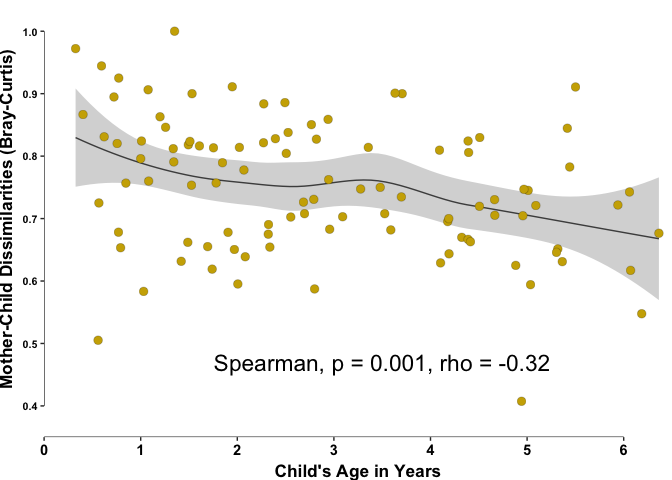
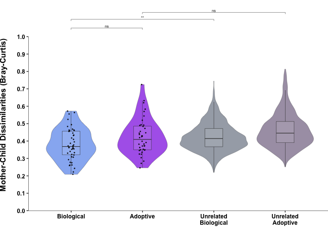

Adoption Study Publication Script
================
Chiranjit Mukherjee
12/22/2019

Adoption Study Data Analysis & Visualization Demo
-------------------------------------------------

<br> <br>

#### Setting seed

``` r
set.seed(12345)
```

<br>

#### Loading required libraries and custom functions

``` r
# Load required libraries
library(reshape2)
library(dada2)
library(vegan)
library(ggplot2)
library(GUniFrac)
library(ggpubr)
library(readxl)
library(RColorBrewer)
library(seqRFLP)
library(gtools)
library(dplyr)

# Custom functions used in this analysis

# For loading R objects from other environments
loadER <- function (rdata, object) {
  local({
    load(rdata)
    eval(parse(text = object))
  })
}

# Function mellt.dist to melt distance objects
melt.dist <- function(x,only_identity = FALSE,omit_identity=TRUE) {
  library(reshape2)
  if(!is.matrix(x)) {
    x <- as.matrix(x)
  }
  y <- melt(x)
  if(omit_identity) {
    l <- list();
    nr <- nrow(x);
    nin <- c();
    for(i in 0:(nr - 1)){
      rs <- (i * nr)+1;
      if(only_identity==FALSE) {
        l[[i+1]] <- (rs+i):(rs+nr-1)
      } else {
        l[[i+1]] <- (rs+i)
      }
    }
    l <- -c(unlist(l))
    y <- y[l,]
  }
  return(y)
}

# Function to melt distance, add same/diff family info, and tabulate into dataframes
AD.melt.dist.sf <- function(asv_table,meta){
  
  # Calculate Distance matrix
  dist <- vegdist(asv_table, method = "bray")
  dist1 <- vegdist(asv_table, method = "jaccard")
  
  # Melt dist
  dist_melt <- melt.dist(dist) # BC
  dist1_melt <- melt.dist(dist1) # JC
  
  # Add relevant meta fields
  dist_melt$fam1 <- meta$family_id[match(dist_melt$Var1, meta$sample)] # BC
  dist_melt$fam2 <- meta$family_id[match(dist_melt$Var2, meta$sample)] # BC
  
  dist1_melt$fam1 <- meta$family_id[match(dist1_melt$Var1, meta$sample)] # JC
  dist1_melt$fam2 <- meta$family_id[match(dist1_melt$Var2, meta$sample)] # JC
  
  # Adding same/diff markers
  dist_melt$family <- "Same Family" # BC
  dist_melt[dist_melt$fam1!=dist_melt$fam2,]$family <- "Diff Family" # BC
  
  dist1_melt$family <- "Same Family" # JC
  dist1_melt[dist1_melt$fam1!=dist1_melt$fam2,]$family <- "Diff Family" # JC
  
  # Subset for samefam
  dist_melt_sf <- dist_melt[dist_melt$family=="Same Family",] # BC
  dist_melt_sf$status <- meta$status[match(dist_melt_sf$Var2, meta$sample)] # BC
  
  dist1_melt_sf <- dist1_melt[dist1_melt$family=="Same Family",] # JC
  dist1_melt_sf$status <- meta$status[match(dist1_melt_sf$Var2, meta$sample)] # JC
  
  # Subset for different family
  dist_melt_df <- dist_melt[dist_melt$family=="Diff Family",] # BC
  dist_melt_df$status <- "Unrelated"
  
  dist1_melt_df <- dist1_melt[dist1_melt$family=="Diff Family",] # JC
  dist1_melt_df$status <- "Unrelated"
  
  # Output
  list(
    dm = dist_melt,
    dmsf = dist_melt_sf,
    dmdf = dist_melt_df,
    jm = dist1_melt,
    jmsf = dist1_melt_sf,
    jmdf = dist1_melt_df
    
  )
}

# Function to calculate P value using the permutation method 
# (alternative to Wilcox test when one group is unrelated subjects)
perm_p_value <- function(otu_table, meth){
  set.seed(12345)
  t = 1000 # permutation times
  
  sub_n = nrow(otu_table)/2 #'sub_n' is the sample size of off-diagnonal subsample, 
                            # let it be the same as diagonal entries (=48)
  
  # input table, 
  # note: the data of paired mom and child, should be adjacent in the table, 
  # mom or child always comes first, e.g M1,C1,M2,C2...
  mc_data <- otu_table
  
  #check pairing
  if(nrow(mc_data)%%2==1){stop('Error: number of subject is odd.')}
  n_pair <- nrow(mc_data)/2 # number of pairs
  
  #compute full B-C dissimilarity matrix
  dist_full_matrix <- vegdist(mc_data, method = meth) %>% as.matrix()
  
  # dist btw mom and child
  D <- dist_full_matrix[(1:n_pair)*2,((1:n_pair)*2-1)]
  
  # observed test statistic
  median_diff_obs <- median(D[row(D)>col(D)]) - median(diag(D))
  
  # permuation
  stat_perm <- rep(0,t)
  
  for(i in 1:t){
    D_perm <- D[,sample(n_pair)] # permute childrens
    # compute statistics from permutation (only use sub_n off-diag entries for lower power)
    stat_perm[i] <- median(sample(D_perm[row(D_perm)>col(D_perm)],sub_n)) - median(diag(D_perm))
  }
  
  #compute p.value
  stat_perm_mean <- mean(stat_perm)
  # p.value is proportion of observed test stat. more extreme than 
  # the permutated test statistics, which form the null distribution
  p.value_diff <- mean((stat_perm-stat_perm_mean)^2>(median_diff_obs-stat_perm_mean)^2)
  
  # Convert to star
  perm_pval_star <- stars.pval(p.value_diff)[1]
  
  # Set label as "ns" when not significant
  if (perm_pval_star == "." | perm_pval_star == " "){ 
    perm_pval_star = "ns"
  }
  
  # Output
  list(
    pval = p.value_diff,
    pval_star = perm_pval_star
  )
  
}


# Converting Wilcox test p values to star symbols
wilcox_pval_star <- function(value, grp){
  
  # Load required library
  library(gtools) # for stars pval function
  
  # Set seed
  set.seed(12345)
  
  # Wilcox test
  w_pval <- wilcox.test(value ~ grp, exact=F)$p.value
  
  # Convert to star
  w_pval_star <- stars.pval(w_pval)[1]
  
  # Set label as "ns" when not significant
  if ( w_pval_star == "." |  w_pval_star == " "){ 
    w_pval_star = "ns"
  }
  
  # Output
  list(
    pval = w_pval,
    pval_star = w_pval_star
  )
  
}

# Function for calculating distance for individual species
species_dist_calc_sal <- function(otu_name){
  
  # For mother-child comparisons
  # Subset for genus
  species_counts_mch <- ISR_sal_matched_mch[,colnames(ISR_sal_matched_mch) %in% row.names(ISR_blast_matches_sal[ISR_blast_matches_sal$otu1==otu_name,])]
  
  # For presence/absence
  # Add "other" column
  species_counts_mch$other <- rowSums(ISR_sal_matched_mch) - rowSums(species_counts_mch)
  
  # Rarefy
  set.seed(12345); species_counts_mch_rar <- as.data.frame(rrarefy(species_counts_mch, min(rowSums(species_counts_mch))))
  
  # Remove other column
  species_counts_mch_rar$other <- NULL
  species_counts_mch$other <- NULL
  
  # Presence/Absence
  species_prabs <- data.frame((species_counts_mch_rar > 0)*1)
  
  # Calculate dist for sf plots
  species_prab_sfd <- AD.melt.dist.sf(species_prabs, ISR_sal_meta_mch)$dmsf
  species_prab_sfd$otu <- otu_name
  
  return(species_prab_sfd)
}
```

<br>

#### Load all samples final ASV table

(See Adoption Data Filtering Script for details)

``` r
ISR_seqtab_atab_comb_filtp_clean <- read.table(file="Input_files/ISR_seqtab_atab_comb_filtp_clean.txt", sep="\t", header = T)
dim(ISR_seqtab_atab_comb_filtp_clean) # 778 4067
```

    ## [1]  778 4067

``` r
# Rarefying raw counts for converting to presence/absence
# Rarefy counts
set.seed(12345); ISR_seqtab_atab_comb_filtp_clean_rar <- as.data.frame(rrarefy(ISR_seqtab_atab_comb_filtp_clean, min(rowSums(ISR_seqtab_atab_comb_filtp_clean))))

# Convert Rarified counts to Pr/Ab:
ISR_seqtab_atab_comb_filtp_clean_prab <- data.frame((ISR_seqtab_atab_comb_filtp_clean_rar > 0)*1)
```

<br>

#### Load all metadata files

``` r
# All ISR Samples clinical metadata (See AD_clinical_metadata_processing.R)
AD_clinical_meta_2019_ISR <- read.table(file="Input_files/AD_clinical_meta_2019_ISR.txt", sep="\t", header = T)
dim(AD_clinical_meta_2019_ISR) # 265  24
```

    ## [1] 265  24

``` r
# Mother-Child ISR Samples clinical metadata (age matched)
AD_clinical_meta_2019_ISR_mch <- read.table(file="Input_files/AD_clinical_meta_2019_ISR_mch.txt", sep="\t", header = T)
dim(AD_clinical_meta_2019_ISR_mch) # 210  24
```

    ## [1] 210  24

<br> <br> <br>

ISR Sites NMDS
--------------

<br> \#\#\# NMDS plot based on sites and mother/child groups <br> \#\#\#\# Compute NMDS and PERMANOVA

``` r
# Create table for all ISR samples sequenced
all_site_samples <- data.frame(row.names(ISR_seqtab_atab_comb_filtp_clean))
colnames(all_site_samples) <- "samples"
all_site_samples$sample <- all_site_samples$samples

all_site_samples$sample <- gsub("_P1_ISR", "", all_site_samples$sample)
all_site_samples$sample <- gsub("_P2_ISR", "", all_site_samples$sample)
all_site_samples$sample <- gsub("_S_ISR", "", all_site_samples$sample)

# Add subject info
all_site_samples$type <- AD_clinical_meta_2019_ISR$type[match(all_site_samples$sample, AD_clinical_meta_2019_ISR$sample)]

# Add site info
all_site_samples$site <- as.character(all_site_samples$samples)
all_site_samples$site[grepl("P1", all_site_samples$site)] <- "Supragingival Plaque"
all_site_samples$site[grepl("P2", all_site_samples$site)] <- "Subgingival Plaque"
all_site_samples$site[grepl("_S", all_site_samples$site)] <- "Soft Tissue/Saliva Swab"

# Subset for mother-child only
all_site_samples_mch <- all_site_samples[all_site_samples$type == "Mother" | all_site_samples$type == "Child", ]
nrow(all_site_samples_mch) # 710

# Subset counts
ISR_all_sites_mch_counts <- ISR_seqtab_atab_comb_filtp_clean[row.names(ISR_seqtab_atab_comb_filtp_clean) %in% all_site_samples_mch$samples, ]
ISR_all_sites_mch_counts <- ISR_all_sites_mch_counts[,colSums(ISR_all_sites_mch_counts) > 0]
dim(ISR_all_sites_mch_counts) # 710 3949

# Rarefy counts
set.seed(12345); ISR_all_sites_mch_counts_rar <- as.data.frame(rrarefy(ISR_all_sites_mch_counts, min(rowSums(ISR_all_sites_mch_counts))))

# Convert Rarified counts to Pr/Ab:
ISR_all_sites_mch_counts_prab <- data.frame((ISR_all_sites_mch_counts_rar > 0)*1)

# Compute NMDS
set.seed(12345); ISR_all_sites_mch_counts_prab.mds <- metaMDS(ISR_all_sites_mch_counts_prab, trymax = 200, autotransform = F, wascores = F)

# Making dataframe for plotting
ISR_all_sites_mch_counts_prab.mds.df <- data.frame(scores(ISR_all_sites_mch_counts_prab.mds, display = 'sites'))

# Add subject type info
ISR_all_sites_mch_counts_prab.mds.df$type <- all_site_samples$type[match(row.names(ISR_all_sites_mch_counts_prab.mds.df), all_site_samples$samples)]
ISR_all_sites_mch_counts_prab.mds.df$site <- all_site_samples$site[match(row.names(ISR_all_sites_mch_counts_prab.mds.df), all_site_samples$samples)]
# View(ISR_all_sites_mch_counts_prab.mds.df)

# Permanova
set.seed(12345); (ISR_all_sites_mch_mds_df.mch.perm <- adonis(formula = ISR_all_sites_mch_counts_prab ~ ISR_all_sites_mch_counts_prab.mds.df$type, strata =  ISR_all_sites_mch_counts_prab.mds.df$site)) 
# 0.001 ***

set.seed(12345); (ISR_all_sites_mch_mds_df.site.perm <- adonis(formula = ISR_all_sites_mch_counts_prab ~ ISR_all_sites_mch_counts_prab.mds.df$site, strata =  ISR_all_sites_mch_counts_prab.mds.df$type)) 
# 0.001 ***
```

<br> <br>

#### Plot NMDS for ISR Mch + Site

<br> 

<br> <br>

Saliva Samples
--------------

<br>

### Subset Metadata and Counts

``` r
# Saliva/Swab Samples

# Subset Data for ISR Saliva/Swab
ISR_sal_all <- ISR_seqtab_atab_comb_filtp_clean[grepl("_S", row.names(ISR_seqtab_atab_comb_filtp_clean)),]
ISR_sal <- ISR_sal_all[,colSums(ISR_sal_all) > 0]
dim(ISR_sal) # 262 2094
```

    ## [1]  262 2094

``` r
# Remove _S for matching with Metadata
row.names(ISR_sal) <- gsub("_S_ISR" , "", row.names(ISR_sal))

# Subset meta for saliva samples
ISR_sal_meta_all_mch <- AD_clinical_meta_2019_ISR_mch[AD_clinical_meta_2019_ISR_mch$sample %in% row.names(ISR_sal), ]
dim(ISR_sal_meta_all_mch) # 208 x 24
```

    ## [1] 208  24

``` r
# Remove unbalanced grps
ISR_sal_meta_all_mch <- ISR_sal_meta_all_mch[!(ISR_sal_meta_all_mch$family_id %in% names(which(table(ISR_sal_meta_all_mch$family_id) < 2))), ]
dim(ISR_sal_meta_all_mch) # 206 x 24
```

    ## [1] 206  24

``` r
# Final composition
table(ISR_sal_meta_all_mch$sub_type)
```

    ## 
    ##     Adopted Child    Adopted Mother  Biological Child Biological Mother 
    ##                49                49                54                54

``` r
# Adopted Child    Adopted Mother  Biological Child Biological Mother 
#     49                49                54                54 

# Make Final Meta for Sal
ISR_sal_meta_mch <- ISR_sal_meta_all_mch

# Reset order
ISR_sal_meta_mch <- ISR_sal_meta_mch[order(ISR_sal_meta_mch$sample), ]

# Test age balance
ISR_sal_meta_mch_ch <- ISR_sal_meta_mch[ISR_sal_meta_mch$type == "Child", ]
set.seed(12345);wilcox.test(ISR_sal_meta_mch_ch$age ~ ISR_sal_meta_mch_ch$status)$p.value # p-value = 0.2937314 (Not Significant)
```

    ## [1] 0.2937314

``` r
# For Mother-Child Comparisons
ISR_sal_mch <- ISR_sal[row.names(ISR_sal) %in% ISR_sal_meta_mch$sample,] # Using original ISR_sal_meta file to extract
ISR_sal_mch <- ISR_sal_mch[,colSums(ISR_sal_mch) > 0]
dim(ISR_sal_mch) # 206 1913
```

    ## [1]  206 1913

``` r
# AD_104_M is the Adopted mother of AD_212_C (Family 43)
# Renaming AD_104_M to AD_212_M
ISR_sal_meta_mch$sample <- gsub("AD_104_M", "AD_212_M", ISR_sal_meta_mch$sample)
# Also need to rename ISR_sal ASV table

# Reset name to match meta (104_M is the mother of 212_C)
row.names(ISR_sal_mch) <- gsub("AD_104_M", "AD_212_M", row.names(ISR_sal_mch))
ISR_sal_mch <- ISR_sal_mch[order(row.names(ISR_sal_mch)), ]

# Sanity check
all(row.names(ISR_sal_mch) == sort(ISR_sal_meta_mch$sample)) # TRUE
```

    ## [1] TRUE

<br>

### Computing Mother-Child Distances

``` r
# Pr/Ab Analysis
# Rarefy counts
set.seed(12345); ISR_sal_mch_rar <- as.data.frame(rrarefy(ISR_sal_mch, min(rowSums(ISR_sal_mch))))

# Convert Rarified counts to Pr/Ab:
ISR_sal_mch_prab <- data.frame((ISR_sal_mch_rar > 0)*1)

# Bio
ISR_sal_mch_prab_bio <- ISR_sal_mch_prab[row.names(ISR_sal_mch_prab) %in% ISR_sal_meta_mch$sample[ISR_sal_meta_mch$status == "Biological"], ]
ISR_sal_mch_prab_bio <- ISR_sal_mch_prab_bio[,colSums(ISR_sal_mch_prab_bio) > 0]
dim(ISR_sal_mch_prab_bio) # 108 1324
```

    ## [1]  108 1324

``` r
# Adp
ISR_sal_mch_prab_adp <- ISR_sal_mch_prab[row.names(ISR_sal_mch_prab) %in% ISR_sal_meta_mch$sample[ISR_sal_meta_mch$status == "Adopted"], ]
ISR_sal_mch_prab_adp <- ISR_sal_mch_prab_adp[,colSums(ISR_sal_mch_prab_adp) > 0]
dim(ISR_sal_mch_prab_adp) # 98 1296
```

    ## [1]   98 1296

``` r
# Compute distances and melt
ISR_sal_mch_prab_sfd <- AD.melt.dist.sf(ISR_sal_mch_prab, ISR_sal_meta_mch)$dmsf

# Edit group name
ISR_sal_mch_prab_sfd$status <- gsub("Adopted", "Adoptive", ISR_sal_mch_prab_sfd$status)

# Subset diff family for M-C only
ISR_sal_mch_prab_dfd_bio <- AD.melt.dist.sf(ISR_sal_mch_prab_bio, ISR_sal_meta_mch)$dmdf
ISR_sal_mch_prab_dfd_adp <- AD.melt.dist.sf(ISR_sal_mch_prab_adp, ISR_sal_meta_mch)$dmdf

# For M-C Only
# Bio
ISR_sal_mch_prab_dfd_bio$type1 <- ISR_sal_meta_mch$type[match(ISR_sal_mch_prab_dfd_bio$Var1, ISR_sal_meta_mch$sample)]
ISR_sal_mch_prab_dfd_bio$type2 <- ISR_sal_meta_mch$type[match(ISR_sal_mch_prab_dfd_bio$Var2, ISR_sal_meta_mch$sample)]
ISR_sal_mch_prab_dfd_bio_mc <- ISR_sal_mch_prab_dfd_bio[ISR_sal_mch_prab_dfd_bio$type1 != ISR_sal_mch_prab_dfd_bio$type2, ]

# Adp
ISR_sal_mch_prab_dfd_adp$type1 <- ISR_sal_meta_mch$type[match(ISR_sal_mch_prab_dfd_adp$Var1, ISR_sal_meta_mch$sample)]
ISR_sal_mch_prab_dfd_adp$type2 <- ISR_sal_meta_mch$type[match(ISR_sal_mch_prab_dfd_adp$Var2, ISR_sal_meta_mch$sample)]
ISR_sal_mch_prab_dfd_adp_mc <- ISR_sal_mch_prab_dfd_adp[ISR_sal_mch_prab_dfd_adp$type1 != ISR_sal_mch_prab_dfd_adp$type2, ]

# Remove type columns
ISR_sal_mch_prab_dfd_bio_mc <- ISR_sal_mch_prab_dfd_bio_mc[,c(1:7)]
ISR_sal_mch_prab_dfd_adp_mc <- ISR_sal_mch_prab_dfd_adp_mc[,c(1:7)]

# Rename status
ISR_sal_mch_prab_dfd_bio_mc$status <- gsub("Unrelated", "Unrelated Biological", ISR_sal_mch_prab_dfd_bio_mc$status)
ISR_sal_mch_prab_dfd_adp_mc$status <- gsub("Unrelated", "Unrelated Adoptive", ISR_sal_mch_prab_dfd_adp_mc$status)

# Combine for plotting
ISR_sal_mch_prab_sdfd <- rbind(ISR_sal_mch_prab_sfd, ISR_sal_mch_prab_dfd_bio_mc, ISR_sal_mch_prab_dfd_adp_mc)
ISR_sal_mch_prab_sdfd$status <- factor(ISR_sal_mch_prab_sdfd$status, levels=c("Biological", "Adoptive", "Unrelated Biological", "Unrelated Adoptive"))

# Calculate P value for bio/adp
ISR_sal_mch_prab_sfd_wilc <- wilcox_pval_star(ISR_sal_mch_prab_sfd$value, ISR_sal_mch_prab_sfd$status)$pval_star

# Calculate respective P values for bio unrelated
ISR_sal_mch_prab_bio_perm_pval_star <- perm_p_value(ISR_sal_mch_prab_bio,"bray")$pval_star

# Calculate respective P values for adp unrelated
ISR_sal_mch_prab_adp_perm_pval_star <- perm_p_value(ISR_sal_mch_prab_adp,"bray")$pval_star
```

<br>

#### Plot Violin + Boxplot + jitter

<br>

``` r
ggplot(ISR_sal_mch_prab_sdfd, aes(x=status, y = value)) + geom_violin(alpha=0.7, width=0.95, lwd=0.1,  aes(fill=status)) + 
  scale_fill_manual(values=c("cornflowerblue", "blueviolet", "#7B8492", "#827290")) +  geom_boxplot(alpha=0.1, width=0.25, lwd=0.2, outlier.shape = NA) +
  geom_jitter(data=ISR_sal_mch_prab_sfd, alpha=0.75, size=0.3, width = 0.05, height = 0) + scale_x_discrete(labels=function(x){sub("\\s", "\n", x)}) +
  scale_y_continuous(breaks=c(0,0.1,0.2,0.3,0.4,0.5,0.6,0.7,0.8,0.9,1.0), limits = c(0,1.2), expand = c(0,0)) +
  annotate(x=1,xend=2,y=1.05,yend=1.05, lwd=0.15,geom="segment") + annotate(x=1,xend=1,y=1.05,yend=1.04,lwd=0.15,geom="segment") + annotate(x=2,xend=2,y=1.05,yend=1.04,lwd=0.15,geom="segment") +
  annotate("text", label = ISR_sal_mch_prab_sfd_wilc, x = 1.5, y = 1.06, size=2) + 
  annotate(x=1,xend=3,y=1.10,yend=1.10, lwd=0.15,geom="segment") + annotate(x=1,xend=1,y=1.10,yend=1.09,lwd=0.15,geom="segment") + annotate(x=3,xend=3,y=1.10,yend=1.09,lwd=0.15,geom="segment") +
  annotate("text", label = ISR_sal_mch_prab_bio_perm_pval_star, x = 2, y = 1.11, size=2) + 
  annotate(x=2,xend=4,y=1.14,yend=1.14, lwd=0.15,geom="segment") + annotate(x=2,xend=2,y=1.14,yend=1.13,lwd=0.15,geom="segment") + annotate(x=4,xend=4,y=1.14,yend=1.13,lwd=0.15,geom="segment") +
  annotate("text", label = ISR_sal_mch_prab_adp_perm_pval_star, x = 3, y = 1.15, size=2) + 
  annotate(x=0.4, xend=0.4, y=0, yend=1, lwd=0.4, geom="segment") + 
  labs(x = "", y = "Mother-Child Dissimilarities (Bray-Curtis)") + theme_classic() + 
  theme(plot.title = element_blank(), 
        axis.text.x = element_text(size=9, face="bold", color="black", hjust = 0.5), axis.line.x = element_line(size = 0.2), 
        axis.text.y = element_text(size=9, face="bold", color="black"), axis.title.y = element_text(size=12, face="bold", color="black", margin = margin(r=15), hjust = 0.35), axis.line.y = element_blank(),
        plot.margin = unit(c(0.1,0,0,0), "cm"), legend.position = "none")
```


``` r
#ggsave(file="output/ISR_sal_mch_violin_jitter_final.pdf", width = 3.5, height = 5.2, units = "in")
```

<br>

#### For ISR Sal metadata analysis

``` r
# Add BC distances to ch metadata
ISR_sal_meta_mch_ch$dist <- ISR_sal_mch_prab_sfd$value[match(ISR_sal_meta_mch_ch$sample, ISR_sal_mch_prab_sfd$Var1)]
nrow(ISR_sal_meta_mch_ch)
```

    ## [1] 103

``` r
# Subset for mother
ISR_sal_meta_mch_mo <- ISR_sal_meta_mch[ISR_sal_meta_mch$type == "Mother", ]
nrow(ISR_sal_meta_mch_mo) # 103
```

    ## [1] 103

``` r
# Output
write.table(ISR_sal_meta_mch_mo, sep = "\t", quote = F, row.names = F, file="Intermed_files/ISR_sal_meta_mch_mo.txt")
write.table(ISR_sal_meta_mch_ch, sep = "\t", quote = F, row.names = F, file="Intermed_files/ISR_sal_meta_mch_ch.txt")
```

### See ISR Sal Metadata Analysis.Rmd for Detailed Metadata Analysis and Confounder Analysis

<br>

### ISR Subgingival

<br> <br> \#\#\# Subset Metadata and Counts

``` r
# ISR Subgingival
ISR_sub_all <- ISR_seqtab_atab_comb_filtp_clean[grepl("P2", row.names(ISR_seqtab_atab_comb_filtp_clean)),]
ISR_sub <- ISR_sub_all[,colSums(ISR_sub_all) > 0]
dim(ISR_sub) # 255 3237
```

    ## [1]  255 3250

``` r
# Remove _P1 for matching with Meta
row.names(ISR_sub) <- gsub("_P2_ISR" , "", row.names(ISR_sub))

# For Mother-Child Comparisons
ISR_sub_mch_all <- ISR_sub[row.names(ISR_sub) %in% ISR_sal_meta_mch$sample,]
ISR_sub_mch_all <- ISR_sub_mch_all[,colSums(ISR_sub_mch_all) > 0]
dim(ISR_sub_mch_all) # 197 2860
```

    ## [1]  197 2869

``` r
# Subset meta for sup mch dataset
ISR_sub_meta_mch_all <- ISR_sal_meta_mch[ISR_sal_meta_mch$sample %in% row.names(ISR_sub_mch_all), ]
table(ISR_sub_meta_mch_all$sub_type)
```

    ## 
    ##     Adopted Child    Adopted Mother  Biological Child Biological Mother 
    ##                46                46                52                53

``` r
# Adopted Child    Adopted Mother  Biological Child Biological Mother 
#    46                46                52                53 

# Remove unbalanced grps
ISR_sub_meta_mch <- ISR_sub_meta_mch_all[!(ISR_sub_meta_mch_all$family_id %in% names(which(table(ISR_sub_meta_mch_all$family_id) < 2))), ]
nrow(ISR_sub_meta_mch) # 190
```

    ## [1] 190

``` r
table(ISR_sub_meta_mch$sub_type)
```

    ## 
    ##     Adopted Child    Adopted Mother  Biological Child Biological Mother 
    ##                44                44                51                51

``` r
# Adopted Child    Adopted Mother  Biological Child Biological Mother 
#      44                44                51                51 
# Balanced

# Test age balance
ISR_sub_meta_mch_ch <- ISR_sub_meta_mch[ISR_sub_meta_mch$type == "Child", ]
set.seed(12345);wilcox.test(ISR_sub_meta_mch_ch$age ~ ISR_sub_meta_mch_ch$status)$p.value # p-value = 0.6436 (Not Significant)
```

    ## [1] 0.6435509

``` r
# Subset counts for final comparison
ISR_sub_mch <- ISR_sub_mch_all[row.names(ISR_sub_mch_all) %in% ISR_sub_meta_mch$sample, ]
ISR_sub_mch <- ISR_sub_mch[, colSums(ISR_sub_mch) > 0]
dim(ISR_sub_mch) # 190 x 2821
```

    ## [1]  190 2821

``` r
# Re-order
ISR_sub_mch <- ISR_sub_mch[order(row.names(ISR_sub_mch)), ]

# Sanity check
all(row.names(ISR_sub_mch) == ISR_sub_meta_mch$sample) # TRUE
```

    ## [1] TRUE

<br>

### Computing Mother-Child Distances

    ## [1]  102 2036

    ## [1]   88 1596

<br>

#### Plot Violin + Boxplot + jitter

<br>  <br> <br>

### ISR Supragingival

<br> <br> \#\#\# Subset Metadata and Counts

``` r
# ISR Subgingival
ISR_sup_all <- ISR_seqtab_atab_comb_filtp_clean[grepl("P1", row.names(ISR_seqtab_atab_comb_filtp_clean)),]
ISR_sup <- ISR_sup_all[,colSums(ISR_sup_all) > 0]
dim(ISR_sup) # 261 2771
```

    ## [1]  261 2780

``` r
# Remove _P1 for matching with Meta
row.names(ISR_sup) <- gsub("_P1_ISR" , "", row.names(ISR_sup))

# For Mother-Child Comparisons
ISR_sup_mch_all <- ISR_sup[row.names(ISR_sup) %in% ISR_sal_meta_mch$sample,]
ISR_sup_mch_all <- ISR_sup_mch_all[,colSums(ISR_sup_mch_all) > 0]
dim(ISR_sup_mch_all) # 202 2363
```

    ## [1]  202 2369

``` r
# Subset meta for sup mch dataset
ISR_sup_meta_mch_all <- ISR_sal_meta_mch[ISR_sal_meta_mch$sample %in% row.names(ISR_sup_mch_all), ]
table(ISR_sup_meta_mch_all$sub_type)
```

    ## 
    ##     Adopted Child    Adopted Mother  Biological Child Biological Mother 
    ##                47                48                53                54

``` r
# Adopted Child    Adopted Mother  Biological Child Biological Mother 
#    47                48                53                54

# Remove unbalanced grps
ISR_sup_meta_mch <- ISR_sup_meta_mch_all[!(ISR_sup_meta_mch_all$family_id %in% names(which(table(ISR_sup_meta_mch_all$family_id) < 2))), ]
nrow(ISR_sup_meta_mch) # 198
```

    ## [1] 198

``` r
table(ISR_sup_meta_mch$sub_type)
```

    ## 
    ##     Adopted Child    Adopted Mother  Biological Child Biological Mother 
    ##                46                46                53                53

``` r
# Adopted Child    Adopted Mother  Biological Child Biological Mother 
#      46                46                53                53 
# Balanced

# Test age balance
ISR_sup_meta_mch_ch <- ISR_sup_meta_mch[ISR_sup_meta_mch$type == "Child", ]
set.seed(12345);wilcox.test(ISR_sup_meta_mch_ch$age ~ ISR_sup_meta_mch_ch$status)$p.value # p-value = 0.436127 (Not Significant)
```

    ## [1] 0.436127

``` r
# Subset counts for final comparison
ISR_sup_mch <- ISR_sup_mch_all[row.names(ISR_sup_mch_all) %in% ISR_sup_meta_mch$sample, ]
ISR_sup_mch <- ISR_sup_mch[, colSums(ISR_sup_mch) > 0]
dim(ISR_sup_mch) # 198 x 2330
```

    ## [1]  198 2336

``` r
# Re-order
ISR_sup_mch <- ISR_sup_mch[order(row.names(ISR_sup_mch)), ]

# Sanity check
all(row.names(ISR_sup_mch) == ISR_sup_meta_mch$sample) # TRUE
```

    ## [1] TRUE

<br>

### Computing Mother-Child Distances

    ## [1]  106 1546

    ## [1]   92 1383

<br>

#### Plot Violin + Boxplot + jitter

<br> 

<br>

4. ISR Sal M-Ch Shared Strains Barplot
======================================

#### Input updated metdata files

``` r
# Child-only metadata
#ISR_sal_meta_mch_ch <- read.table(file="output/ISR_sal_meta_mch_ch_updated.txt", header = T, sep="\t")

# Mother-only metadata
#ISR_sal_meta_mch_mo <- read.table(file="output/ISR_sal_meta_mch_mo_updated.txt", header = T, sep="\t")
```

#### Subset for mother and child

``` r
# Subset prabs for mo and ch
ISR_sal_mch_prab_mo <- ISR_sal_mch_prab[rownames(ISR_sal_mch_prab) %in% ISR_sal_meta_mch_mo$sample, ]
ISR_sal_mch_prab_ch <- ISR_sal_mch_prab[rownames(ISR_sal_mch_prab) %in% ISR_sal_meta_mch_ch$sample, ]

write.table(ISR_sal_mch_prab_mo, file="output/ISR_sal_mch_prab_mo.txt", sep="\t")
write.table(ISR_sal_mch_prab_ch, file="output/ISR_sal_mch_prab_ch.txt", sep="\t")
```

<br>

5. ISR Sal M-Ch Age Boxplot
---------------------------

<br>

#### Comparison of Age: Biologic vs Adopted Children

``` r
# Age boxplot
ggplot(ISR_sal_meta_mch_ch, aes(x=status, y = age, fill=status)) + 
  scale_fill_manual(values=c("cornflowerblue", "blueviolet")) +  geom_boxplot(alpha=0.75, width=0.6, lwd=0.1, outlier.shape = NA) +
  geom_jitter(alpha=0.7, size=1, width = 0.1, height = 0) + 
  scale_y_continuous(breaks=c(0,3,6,9,12), limits = c(0,13), expand = c(0,0)) +
  stat_compare_means(method = "wilcox.test", label.y.npc = 0.65, label.x.npc = 0.55, size=5) +
  annotate(x=0.4, xend=0.4, y=0, yend=12, lwd=0.4, geom="segment") + 
  labs(y = "Child's Age in Years", x = "") + theme_classic() + 
  theme(axis.text.x = element_text(size=10, face="bold", color="black", hjust = 0.5), 
        axis.line.x = element_line(size = 0.2), axis.line.y = element_blank(),
        axis.text.y = element_text(size=9, face="bold", color="black"), axis.title.y = element_text(size=12, face="bold", color="black"), 
        plot.margin = unit(c(0.1,0,0,0), "cm"), legend.position = "none")
```


``` r
#ggsave(file="output/ISR_sal_age_boxplot.pdf", width = 3, height = 6, units = "in")
```

``` r
# 6. ISR Sal Mother-Child Distance vs Child's Age

# Remove outlier ages (> 10)
ISR_sal_meta_mch_ch_comp <- ISR_sal_meta_mch_ch[ISR_sal_meta_mch_ch$age < 10, ]
dim(ISR_sal_meta_mch_ch_comp) # 101
```

    ## [1] 101  25

``` r
# Add distances values
ISR_sal_meta_mch_ch_comp$dist <- ISR_sal_mch_prab_sfd$value[match(ISR_sal_meta_mch_ch_comp$sample, ISR_sal_mch_prab_sfd$Var1)]

# Test correlation of values with age
set.seed(12345); ISR_sal_meta_mch_ch_comp_agecor <- cor.test(ISR_sal_meta_mch_ch_comp$age, ISR_sal_meta_mch_ch_comp$dist, method = "spearman", exact = F)
ISR_sal_meta_mch_ch_comp_agecor$p.value # 0.001057479
```

    ## [1] 0.001100491

``` r
ISR_sal_meta_mch_ch_comp_agecor$estimate # rho = -0.3211715 
```

    ##        rho 
    ## -0.3201241

``` r
# Make label for plot
ISR_sal_meta_mch_ch_comp_agecor_statlabel <- paste("Spearman, p = ", round(ISR_sal_meta_mch_ch_comp_agecor$p.value, 3), 
                                                   ", rho = ", round(ISR_sal_meta_mch_ch_comp_agecor$estimate, 2), sep="")

# Mother's Age vs M-Ch Distance Plot
ggplot(ISR_sal_meta_mch_ch_comp, aes(age, dist)) + geom_smooth(alpha=0.4, lwd=0.5, color="grey30") + 
  geom_point(size=3, shape=21, stroke=0.1, fill="gold3") +
  scale_y_continuous(limits = c(0.35,1.05), breaks = c(0.4,0.5,0.6,0.7,0.8,0.9,1), expand=c(0,0)) + scale_x_continuous(expand = c(0,0), limits = c(0,6.5), breaks = c(0,1,2,3,4,5,6)) + 
  annotate("text", x = 3.5, y = 0.47, size = 6, label = ISR_sal_meta_mch_ch_comp_agecor_statlabel, col="black") + 
  annotate(x=0, xend=0, y=0.4, yend=1, lwd=0.4, geom="segment") + 
  annotate(x=0, xend=6, y=0.35, yend=0.35, lwd=0.4, geom="segment") + 
  labs(fill="", x = "Child's Age in Years", y = "Mother-Child Dissimilarities (Bray-Curtis)") + theme_classic() + 
  theme(plot.title =  element_text(size=15, face="bold", color="black", hjust = 0.5), axis.text.x = element_text(size=11, face="bold", color="black"), 
        axis.text.y = element_text(size=8, face="bold", color="black"),axis.title.x = element_text(size=13, face="bold", margin = margin(5,0,0,0)), 
        axis.title.y = element_text(size=13, face="bold", color="black", margin = margin(0,5,0,0)), plot.margin = unit(c(0,0,0,0), "cm"), 
        legend.position = "none", axis.line = element_blank())
```

    ## `geom_smooth()` using method = 'loess' and formula 'y ~ x'



``` r
#ggsave(file="output/ISR sal ch age vs dist.pdf", width = 6, height = 6, units = "in")
```

``` r
# 7. ISR Sal: Ch's Shannon vs Ch'Age, M's Shannon


# Children's Alpha Diversity Comparison

# Subset counts for comp 
ISR_sal_mch_ch_comp <- ISR_sal_mch[row.names(ISR_sal_mch) %in% ISR_sal_meta_mch_ch_comp$sample, ]
ISR_sal_mch_ch_comp <- ISR_sal_mch_ch_comp[, colSums(ISR_sal_mch_ch_comp) > 0]
dim(ISR_sal_mch_ch_comp) # 101 1243
```

    ## [1]  101 1248

``` r
# sanity check
all(row.names(ISR_sal_mch_ch_comp) == ISR_sal_meta_mch_ch_comp$sample) # TRUE
```

    ## [1] TRUE

``` r
# Rarefy counts
set.seed(12345); ISR_sal_mch_ch_comp_rar <- as.data.frame(rrarefy(ISR_sal_mch_ch_comp, min(rowSums(ISR_sal_mch_ch_comp))))


# Calculate Alpha Diversity for M-Ch samples

# Calculate Shannon by 100 trials
set.seed(12345); ISR_sal_mch_ch_comp_rar_shannon <- rep(0,nrow(ISR_sal_mch_ch_comp_rar)); trials=100
for(i in 1:trials) { 
  ISR_sal_mch_ch_comp_rar_shannon <- ISR_sal_mch_ch_comp_rar_shannon + diversity(ISR_sal_mch_ch_comp_rar)}

# Mean Shannon
ISR_sal_mch_ch_comp_rar_shannon.mean <- ISR_sal_mch_ch_comp_rar_shannon/trials

# Make data frame for plotting
ISR_sal_mch_ch_comp_rar_alpha.df <- data.frame(ISR_sal_mch_ch_comp_rar_shannon.mean)
colnames(ISR_sal_mch_ch_comp_rar_alpha.df) <- c("Shannon")

# Add subject type info
ISR_sal_mch_ch_comp_rar_alpha.df$age <- ISR_sal_meta_mch_ch_comp$age[match(row.names(ISR_sal_mch_ch_comp_rar_alpha.df),  ISR_sal_meta_mch_ch_comp$sample)]

# Test correlation of values with age
set.seed(12345); ISR_sal_mch_ch_comp_rar_alpha.df_agecor <- cor.test(ISR_sal_mch_ch_comp_rar_alpha.df$age, ISR_sal_mch_ch_comp_rar_alpha.df$Shannon, method = "spearman", exact = F)
# p-value = 2.030.8272834 3.1865993

# Make label for plot
ISR_sal_mch_ch_comp_rar_alpha.df_agecor_statlabel <- paste("Spearman, p = ", signif(ISR_sal_mch_ch_comp_rar_alpha.df_agecor$p.value, 2), 
                                                           ", rho = ", round(ISR_sal_mch_ch_comp_rar_alpha.df_agecor$estimate, 2), sep="")

# Calculate Mean Shannon for Mothers


ISR_sal_mch_mo_comp <- ISR_sal_meta_mch_mo[ISR_sal_meta_mch_mo$family_id %in% ISR_sal_meta_mch_ch_comp$family_id, ]
dim(ISR_sal_mch_mo_comp) # 101 x 25
```

    ## [1] 101  24

``` r
# Subset counts for mothers
ISR_sal_mch_mo_comp <- ISR_sal_mch[row.names(ISR_sal_mch) %in% ISR_sal_mch_mo_comp$sample, ]
ISR_sal_mch_mo_comp <- ISR_sal_mch_mo_comp[, colSums(ISR_sal_mch_mo_comp) > 0]
dim(ISR_sal_mch_mo_comp) # 101 1295
```

    ## [1]  101 1297

``` r
# sanity check
all(row.names(ISR_sal_mch_mo_comp) == ISR_sal_mch_mo_comp$sample) # TRUE
```

    ## [1] TRUE

``` r
# Rarefy counts
set.seed(12345); ISR_sal_mch_mo_comp_rar <- as.data.frame(rrarefy(ISR_sal_mch_mo_comp, min(rowSums(ISR_sal_mch_mo_comp))))

# Calculate Shannon by 100 trials
set.seed(12345); ISR_sal_mch_mo_comp_rar_shannon <- rep(0,nrow(ISR_sal_mch_mo_comp_rar)); trials=100
for(i in 1:trials) { 
  ISR_sal_mch_mo_comp_rar_shannon <- ISR_sal_mch_mo_comp_rar_shannon + diversity(ISR_sal_mch_mo_comp_rar)}

# Mean Shannon
ISR_sal_mch_mo_comp_rar_shannon.mean <- ISR_sal_mch_mo_comp_rar_shannon/trials

# Average mother's alpha
mean(ISR_sal_mch_mo_comp_rar_shannon.mean) # 2.618408
```

    ## [1] 2.61868


Extended Family Analysis
========================

<br>

### Generating distances for extended family comparisons (ISR Saliva Dataset)

``` r
# Metadata for 3 member (mother, father, child) families
ISR_sal_meta_bio_3fam <- read.table(file="Input_files/ISR_sal_meta_bio_3fam.txt", header = T, sep="\t")
dim(ISR_sal_meta_bio_3fam) # 66 x 24 (22 families of M, F, Ch)
```

    ## [1] 66 24

``` r
# Metadata for siblings
ISR_sal_meta_bio_sibs <- read.table(file="Input_files/ISR_sal_meta_bio_sibs.txt", header = T, sep="\t")
dim(ISR_sal_meta_bio_sibs) # 32 x 24 (16 pairs of siblings)
```

    ## [1] 32 24

``` r
# Metadata for 3 member (mother, father, child) families
ISR_sal_meta_bio_cpls <- read.table(file="Input_files/ISR_sal_meta_bio_cpls.txt", header = T, sep="\t")
dim(ISR_sal_meta_bio_cpls) # 44 x 24 (22 couples)
```

    ## [1] 44 24

``` r
# 3 Fam Comparisons 
# a. M-ch vs F-ch, P-ch vs U-ch, Couples vs U-adults

# For Family Comparisons
ISR_sal_3fam <- ISR_sal[row.names(ISR_sal) %in% ISR_sal_meta_bio_3fam$sample,]
ISR_sal_3fam <- ISR_sal_3fam[,colSums(ISR_sal_3fam) > 0]
dim(ISR_sal_3fam) # 66 x 946
```

    ## [1]  66 949

``` r
# sanity check
all(row.names(ISR_sal_3fam) == ISR_sal_meta_bio_3fam$sample) # TRUE
```

    ## [1] TRUE

``` r
# Pr/Ab Analysis
# Rarefy counts
set.seed(12345); ISR_sal_3fam_rar <- as.data.frame(rrarefy(ISR_sal_3fam, min(rowSums(ISR_sal_3fam)))) # min(rowSums(ISR_sal_3fam)) = 25,923

# Convert Rarified counts to Pr/Ab:
ISR_sal_3fam_prab <- data.frame((ISR_sal_3fam_rar > 0)*1)

# Compute distances and melt
ISR_sal_3fam_prab_sfd <- AD.melt.dist.sf(ISR_sal_3fam_prab, ISR_sal_meta_bio_3fam)$dmsf
ISR_sal_3fam_prab_dfd <- AD.melt.dist.sf(ISR_sal_3fam_prab, ISR_sal_meta_bio_3fam)$dmdf

# Add subject type info
ISR_sal_3fam_prab_sfd$sub_type1 <- ISR_sal_meta_bio_3fam$subject_type[match(ISR_sal_3fam_prab_sfd$Var1, ISR_sal_meta_bio_3fam$sample)]
ISR_sal_3fam_prab_sfd$sub_type2 <- ISR_sal_meta_bio_3fam$subject_type[match(ISR_sal_3fam_prab_sfd$Var2, ISR_sal_meta_bio_3fam$sample)]

# Remove "Biological "
ISR_sal_3fam_prab_sfd$sub_type1 <- gsub("Biological ", "", ISR_sal_3fam_prab_sfd$sub_type1)
ISR_sal_3fam_prab_sfd$sub_type2 <- gsub("Biological ", "", ISR_sal_3fam_prab_sfd$sub_type2)

# Combine sub_type to define relationship
ISR_sal_3fam_prab_sfd$grp <- paste(ISR_sal_3fam_prab_sfd$sub_type1, ISR_sal_3fam_prab_sfd$sub_type2, sep="-")

# For Child-Father vs Child-Mother comparison

# Child-Father and Child-Mother
ISR_sal_3fam_prab_sfd_cfm <- ISR_sal_3fam_prab_sfd[ISR_sal_3fam_prab_sfd$grp == "Child-Father" | ISR_sal_3fam_prab_sfd$grp == "Child-Mother", ]
ISR_sal_3fam_prab_sfd_cfm$sub_type1 <- NULL
ISR_sal_3fam_prab_sfd_cfm$sub_type2 <- NULL
nrow(ISR_sal_3fam_prab_sfd_cfm) # 44
```

    ## [1] 44

``` r
unique(ISR_sal_3fam_prab_sfd_cfm$grp)
```

    ## [1] "Child-Father" "Child-Mother"

``` r
# "Child-Father" "Child-Mother"

# For diff fam:
# Add subject type info
ISR_sal_3fam_prab_dfd$sub_type1 <- ISR_sal_meta_bio_3fam$subject_type[match(ISR_sal_3fam_prab_dfd$Var1, ISR_sal_meta_bio_3fam$sample)]
ISR_sal_3fam_prab_dfd$sub_type2 <- ISR_sal_meta_bio_3fam$subject_type[match(ISR_sal_3fam_prab_dfd$Var2, ISR_sal_meta_bio_3fam$sample)]

# Remove "Biological "
ISR_sal_3fam_prab_dfd$sub_type1 <- gsub("Biological ", "", ISR_sal_3fam_prab_dfd$sub_type1)
ISR_sal_3fam_prab_dfd$sub_type2 <- gsub("Biological ", "", ISR_sal_3fam_prab_dfd$sub_type2)

# Combine sub_type to define relationship
ISR_sal_3fam_prab_dfd$grp <- paste(ISR_sal_3fam_prab_dfd$sub_type1, ISR_sal_3fam_prab_dfd$sub_type2, sep="-")

# For unrelated child-father
ISR_sal_3fam_prab_dfd_ucf <- ISR_sal_3fam_prab_dfd[ISR_sal_3fam_prab_dfd$grp == "Child-Father" | ISR_sal_3fam_prab_dfd$grp == "Father-Child", ]
ISR_sal_3fam_prab_dfd_ucf$sub_type1 <- NULL
ISR_sal_3fam_prab_dfd_ucf$sub_type2 <- NULL
#View(ISR_sal_3fam_prab_dfd_ucf)

# Rename grp
ISR_sal_3fam_prab_dfd_ucf$grp <- gsub("Father-Child", "Child-Father", ISR_sal_3fam_prab_dfd_ucf$grp)
ISR_sal_3fam_prab_dfd_ucf$grp <- gsub("Child-Father", "Unrelated Child-Father", ISR_sal_3fam_prab_dfd_ucf$grp)
unique(ISR_sal_3fam_prab_dfd_ucf$grp) # "Unrelated Child-Father"
```

    ## [1] "Unrelated Child-Father"

``` r
nrow(ISR_sal_3fam_prab_dfd_ucf) # 462
```

    ## [1] 462

``` r
# Ch_F vs unrel_ad_ch
# Subset meta
ISR_sal_meta_bio_3fam_ch_f <- ISR_sal_meta_bio_3fam[ISR_sal_meta_bio_3fam$sub_type != "Biological Mother", ]
nrow(ISR_sal_meta_bio_3fam_ch_f) # 44
```

    ## [1] 44

``` r
# Subset prabs
ISR_sal_3fam_prab_ch_f <- ISR_sal_3fam_prab[row.names(ISR_sal_3fam_prab) %in% ISR_sal_meta_bio_3fam_ch_f$sample,]
ISR_sal_3fam_prab_ch_f <- ISR_sal_3fam_prab_ch_f[,colSums(ISR_sal_3fam_prab_ch_f) > 0]
dim(ISR_sal_3fam_prab_ch_f) # 44 774
```

    ## [1]  44 774

``` r
# For unrelated child-Mother
ISR_sal_3fam_prab_dfd_ucm <- ISR_sal_3fam_prab_dfd[ISR_sal_3fam_prab_dfd$grp == "Child-Mother" | ISR_sal_3fam_prab_dfd$grp == "Mother-Child", ]
ISR_sal_3fam_prab_dfd_ucm$sub_type1 <- NULL
ISR_sal_3fam_prab_dfd_ucm$sub_type2 <- NULL
#View(ISR_sal_3fam_prab_dfd_ucm)

# Rename grp
ISR_sal_3fam_prab_dfd_ucm$grp <- gsub("Mother-Child", "Child-Mother", ISR_sal_3fam_prab_dfd_ucm$grp)
ISR_sal_3fam_prab_dfd_ucm$grp <- gsub("Child-Mother", "Unrelated Child-Mother", ISR_sal_3fam_prab_dfd_ucm$grp)
unique(ISR_sal_3fam_prab_dfd_ucm$grp) # "Unrelated Child-Mother"
```

    ## [1] "Unrelated Child-Mother"

``` r
nrow(ISR_sal_3fam_prab_dfd_ucm) # 462
```

    ## [1] 462

``` r
# ch_m vs unrel_ad_ch
# Subset meta
ISR_sal_meta_bio_3fam_ch_m <- ISR_sal_meta_bio_3fam[ISR_sal_meta_bio_3fam$sub_type != "Biological Father", ]
nrow(ISR_sal_meta_bio_3fam_ch_m) # 44
```

    ## [1] 44

``` r
# Subset prabs
ISR_sal_3fam_prab_ch_m <- ISR_sal_3fam_prab[row.names(ISR_sal_3fam_prab) %in% ISR_sal_meta_bio_3fam_ch_m$sample,]
ISR_sal_3fam_prab_ch_m <- ISR_sal_3fam_prab_ch_m[,colSums(ISR_sal_3fam_prab_ch_m) > 0]
dim(ISR_sal_3fam_prab_ch_m) # 44 740
```

    ## [1]  44 740

``` r
# Siblings comparisons

# Subset Counts
ISR_sal_sibs <- ISR_sal[row.names(ISR_sal) %in% ISR_sal_meta_bio_sibs$sample,]
ISR_sal_sibs <- ISR_sal_sibs[,colSums(ISR_sal_sibs) > 0]
dim(ISR_sal_sibs) # 32 532
```

    ## [1]  32 535

``` r
# sanity check
all(row.names(ISR_sal_sibs) == ISR_sal_meta_bio_sibs$sample) # TRUE
```

    ## [1] TRUE

``` r
# Pr/Ab Analysis
# Rarefy counts
set.seed(12345); ISR_sal_sibs_rar <- as.data.frame(rrarefy(ISR_sal_sibs, min(rowSums(ISR_sal_sibs))))

# Convert Rarified counts to Pr/Ab:
ISR_sal_sibs_prab <- data.frame((ISR_sal_sibs_rar > 0)*1)

# Compute distances and melt
ISR_sal_sibs_prab_sfd <- AD.melt.dist.sf(ISR_sal_sibs_prab, ISR_sal_meta_bio_sibs)$dmsf
ISR_sal_sibs_prab_sfd$grp <- "Siblings"

ISR_sal_sibs_prab_dfd <- AD.melt.dist.sf(ISR_sal_sibs_prab, ISR_sal_meta_bio_sibs)$dmdf
ISR_sal_sibs_prab_dfd$grp <- "Unrelated Children"


# Couples
# Subset Counts
ISR_sal_cpls <- ISR_sal[row.names(ISR_sal) %in% ISR_sal_meta_bio_cpls$sample,]
ISR_sal_cpls <- ISR_sal_cpls[,colSums(ISR_sal_cpls) > 0]
dim(ISR_sal_cpls) #  44 746
```

    ## [1]  44 749

``` r
# sanity check
all(row.names(ISR_sal_cpls) == ISR_sal_meta_bio_cpls$sample) # TRUE
```

    ## [1] TRUE

``` r
# Pr/Ab Analysis
# Rarefy counts
set.seed(12345); ISR_sal_cpls_rar <- as.data.frame(rrarefy(ISR_sal_cpls, min(rowSums(ISR_sal_cpls))))

# Convert Rarified counts to Pr/Ab:
ISR_sal_cpls_prab <- data.frame((ISR_sal_cpls_rar > 0)*1)

# Compute distances and melt
ISR_sal_cpls_prab_sfd <- AD.melt.dist.sf(ISR_sal_cpls_prab, ISR_sal_meta_bio_cpls)$dmsf
ISR_sal_cpls_prab_sfd$grp <- "Couples"

ISR_sal_cpls_prab_dfd <- AD.melt.dist.sf(ISR_sal_cpls_prab, ISR_sal_meta_bio_cpls)$dmdf
ISR_sal_cpls_prab_dfd$grp <- "Unrelated Adults"


# Add TR data (See ISR_sup_tr.R for Tech Rep data generation)
tr_prab_dist_melt_ss_sal <- read.table("Input_files/tr_prab_dist_melt_ss_sal.txt", header = T, sep = "\t")
tr_prab_dist_melt_ss_sal$grp <- tr_prab_dist_melt_ss_sal$rel

# Combine for plotting
ISR_sal_3fam_all <- rbind(ISR_sal_sibs_prab_sfd, ISR_sal_sibs_prab_dfd, ISR_sal_cpls_prab_sfd, ISR_sal_cpls_prab_dfd, 
                          ISR_sal_3fam_prab_sfd_cfm, ISR_sal_3fam_prab_dfd_ucm, ISR_sal_3fam_prab_dfd_ucf)
# Subset
ISR_sal_3fam_all_plot <- ISR_sal_3fam_all[,c("value", "grp")]

ISR_sal_3fam_all_plot_tr <- rbind(ISR_sal_3fam_all_plot, tr_prab_dist_melt_ss_sal[,c("value", "grp")])

# Define levels (sorting by mean distance of grps, increasing order)
ISR_sal_3fam_all_plot_tr$grp <- factor(ISR_sal_3fam_all_plot_tr$grp, levels=levels(reorder(ISR_sal_3fam_all_plot_tr$grp, ISR_sal_3fam_all_plot_tr$value, median)))
levels(ISR_sal_3fam_all_plot_tr$grp)
```

    ## [1] "Tech. Replicates"       "Siblings"              
    ## [3] "Couples"                "Child-Mother"          
    ## [5] "Child-Father"           "Unrelated Adults"      
    ## [7] "Unrelated Children"     "Unrelated Child-Mother"
    ## [9] "Unrelated Child-Father"

``` r
# "Tech. Replicates"       "Siblings"               "Couples"                "Child-Mother"           "Child-Father"           "Unrelated Adults"       "Unrelated Children"     "Unrelated Child-Mother"
# "Unrelated Child-Father"

ISR_sal_3fam_all_plot_tr$grp <- factor(ISR_sal_3fam_all_plot_tr$grp, levels(ISR_sal_3fam_all_plot_tr$grp)[c(2:9,1)])
levels(ISR_sal_3fam_all_plot_tr$grp)
```

    ## [1] "Siblings"               "Couples"               
    ## [3] "Child-Mother"           "Child-Father"          
    ## [5] "Unrelated Adults"       "Unrelated Children"    
    ## [7] "Unrelated Child-Mother" "Unrelated Child-Father"
    ## [9] "Tech. Replicates"

``` r
# "Siblings"               "Couples"                "Child-Mother"           "Child-Father"           "Unrelated Adults"       "Unrelated Children"     "Unrelated Child-Mother" "Unrelated Child-Father"
# "Tech. Replicates"

# Define colors
ISR_sal_fam_dists_cols_TR <- c("#CD9600", "#F8766D", "#7CAE00", "#00BE67", "#B7A09E", "#B0A68A", "#7F8D5D", "#8AAD9D", "white") 
```

``` r
# Swab ISR 3Fam Violin Plot with Jitters
ggplot(ISR_sal_3fam_all_plot_tr, aes(x=grp, y = value)) + geom_violin(alpha=0.9, width=0.95, lwd=0.1,  aes(fill=grp), position = ) + 
  geom_boxplot(data=ISR_sal_3fam_all_plot_tr[ISR_sal_3fam_all_plot_tr$grp != "Tech. Replicates", ], alpha=0.2, width=0.1, lwd=0.2, outlier.shape = NA) + 
  scale_fill_manual(values=ISR_sal_fam_dists_cols_TR) + 
  geom_point(data=tr_prab_dist_melt_ss_sal, alpha=0.75, color="black", pch=21, stroke = 0.5, size=1,fill="white") + scale_x_discrete(labels=function(x){sub("\\s", "\n", x)}) +
  scale_y_continuous(breaks=c(0,0.2,0.4,0.6,0.8,1.0), limits = c(0,1), expand = c(0,0)) +
  annotate(x=0.4, xend=0.4, y=0, yend=1, lwd=0.4, geom="segment") + 
  labs(title = "Soft Tissue\n", fill="Group", x = "", y = "Bray-Curtis Dissimilarity Index") + theme_classic() + 
  theme(plot.title = element_blank(), axis.text.x = element_text(size=9, face="bold", color="black", hjust = 0.5), axis.line.x = element_line(size = 0.2), 
        axis.text.y = element_text(size=9, face="bold", color="black"), axis.title.y = element_text(size=12, face="bold", color="black", margin = margin(r=15), hjust = 0.35), axis.line.y = element_blank(),
        plot.margin = unit(c(0.1,0,0,0), "cm"), legend.position = "none")
```


``` r
#ggsave(file="output/ISR_Swab_extended_violin_cpl_chm_final.pdf", width = 9, height = 3.5, units = "in")
```

``` r
# Statistics Calculations 

# Child-Father vs Child-Mother using Wilcox Test
wilcox_pval_star(ISR_sal_3fam_prab_sfd_cfm$value, ISR_sal_3fam_prab_sfd_cfm$grp)$pval_star # ns
```

    ## [1] "ns"

``` r
# Couples vs Siblings
ISR_sal_sfd_cpls_sibs <- rbind(ISR_sal_sibs_prab_sfd, ISR_sal_cpls_prab_sfd)
unique(ISR_sal_sfd_cpls_sibs$grp) # "Siblings" "Couples" 
```

    ## [1] "Siblings" "Couples"

``` r
wilcox_pval_star(ISR_sal_sfd_cpls_sibs$value, ISR_sal_sfd_cpls_sibs$grp)$pval_star # ns
```

    ## [1] "ns"

``` r
# Couples vs Child-Mother
ISR_sal_sfd_cpls_cm <- rbind(ISR_sal_cpls_prab_sfd, ISR_sal_3fam_prab_sfd_cfm[ISR_sal_3fam_prab_sfd_cfm$grp == "Child-Mother", ])
unique(ISR_sal_sfd_cpls_cm$grp) # ""Couples"      "Child-Mother"
```

    ## [1] "Couples"      "Child-Mother"

``` r
wilcox_pval_star(ISR_sal_sfd_cpls_cm$value, ISR_sal_sfd_cpls_cm$grp)$pval_star # ***
```

    ## [1] "***"

``` r
# Couples vs Child-Father
ISR_sal_sfd_cpls_cf <- rbind(ISR_sal_cpls_prab_sfd, ISR_sal_3fam_prab_sfd_cfm[ISR_sal_3fam_prab_sfd_cfm$grp == "Child-Father", ])
unique(ISR_sal_sfd_cpls_cf$grp) # "Couples"      "Child-Father"
```

    ## [1] "Couples"      "Child-Father"

``` r
wilcox_pval_star(ISR_sal_sfd_cpls_cf$value, ISR_sal_sfd_cpls_cf$grp)$pval_star # ***
```

    ## [1] "***"

``` r
# Siblings vs Child-Mother
ISR_sal_sfd_sibs_cm <- rbind(ISR_sal_sibs_prab_sfd, ISR_sal_3fam_prab_sfd_cfm[ISR_sal_3fam_prab_sfd_cfm$grp == "Child-Mother", ])
unique(ISR_sal_sfd_sibs_cm$grp) # "Siblings"      "Child-Mother"
```

    ## [1] "Siblings"     "Child-Mother"

``` r
wilcox_pval_star(ISR_sal_sfd_sibs_cm$value, ISR_sal_sfd_sibs_cm$grp)$pval_star # *
```

    ## [1] "*"

``` r
# Siblings vs Child-Father
ISR_sal_sfd_sibs_cf <- rbind(ISR_sal_sibs_prab_sfd, ISR_sal_3fam_prab_sfd_cfm[ISR_sal_3fam_prab_sfd_cfm$grp == "Child-Father", ])
unique(ISR_sal_sfd_sibs_cf$grp) # "Siblings"      "Child-Father"
```

    ## [1] "Siblings"     "Child-Father"

``` r
wilcox_pval_star(ISR_sal_sfd_sibs_cf$value, ISR_sal_sfd_sibs_cf$grp)$pval_star # *
```

    ## [1] "*"

``` r
# Couples vs Unrelated Adults using Permutation test
perm_p_value(ISR_sal_cpls_prab, "bray")$pval_star # ***
```

    ## [1] "***"

``` r
# Sibs vs unrelated children using Permutation test
perm_p_value(ISR_sal_sibs_prab, "bray")$pval_star # ***
```

    ## [1] "***"

``` r
# Child-Father vs unrelated Child-Father using Permutation test
perm_p_value(ISR_sal_3fam_prab_ch_f, "bray")$pval_star # *
```

    ## [1] "*"

``` r
# Child-Mother vs unrelated Child-Mother using Permutation test
perm_p_value(ISR_sal_3fam_prab_ch_m, "bray")$pval_star # **
```

    ## [1] "**"

11. ISR Sal M-Ch Levels (Supplementary)
=======================================

Saliva/Swab Samples
===================

<br> \#\#\# Computing Mother-Child Distances <br>

``` r
# Convert to percentage (relative abundance/levels)
ISR_sal_mch_pct <- decostand(ISR_sal_mch, method = "total")
dim(ISR_sal_mch_pct) # 206 1906
```

    ## [1]  206 1913

``` r
# Bio
ISR_sal_mch_pct_bio <- ISR_sal_mch_pct[row.names(ISR_sal_mch_pct) %in% ISR_sal_meta_mch$sample[ISR_sal_meta_mch$status == "Biological"], ]
ISR_sal_mch_pct_bio <- ISR_sal_mch_pct_bio[,colSums(ISR_sal_mch_pct_bio) > 0]
dim(ISR_sal_mch_pct_bio) # 108 1340
```

    ## [1]  108 1345

``` r
# Adp
ISR_sal_mch_pct_adp <- ISR_sal_mch_pct[row.names(ISR_sal_mch_pct) %in% ISR_sal_meta_mch$sample[ISR_sal_meta_mch$status == "Adopted"], ]
ISR_sal_mch_pct_adp <- ISR_sal_mch_pct_adp[,colSums(ISR_sal_mch_pct_adp) > 0]
dim(ISR_sal_mch_pct_adp) # 98 1308
```

    ## [1]   98 1310

``` r
# Compute distances and melt
ISR_sal_mch_pct_sfd <- AD.melt.dist.sf(ISR_sal_mch_pct, ISR_sal_meta_mch)$dmsf

# Edit group name
ISR_sal_mch_pct_sfd$status <- gsub("Adopted", "Adoptive", ISR_sal_mch_pct_sfd$status)

# Subset diff family for M-C only
ISR_sal_mch_pct_dfd_bio <- AD.melt.dist.sf(ISR_sal_mch_pct_bio, ISR_sal_meta_mch)$dmdf
ISR_sal_mch_pct_dfd_adp <- AD.melt.dist.sf(ISR_sal_mch_pct_adp, ISR_sal_meta_mch)$dmdf

# For M-C Only
# Bio
ISR_sal_mch_pct_dfd_bio$type1 <- ISR_sal_meta_mch$type[match(ISR_sal_mch_pct_dfd_bio$Var1, ISR_sal_meta_mch$sample)]
ISR_sal_mch_pct_dfd_bio$type2 <- ISR_sal_meta_mch$type[match(ISR_sal_mch_pct_dfd_bio$Var2, ISR_sal_meta_mch$sample)]
ISR_sal_mch_pct_dfd_bio_mc <- ISR_sal_mch_pct_dfd_bio[ISR_sal_mch_pct_dfd_bio$type1 != ISR_sal_mch_pct_dfd_bio$type2, ]

# Adp
ISR_sal_mch_pct_dfd_adp$type1 <- ISR_sal_meta_mch$type[match(ISR_sal_mch_pct_dfd_adp$Var1, ISR_sal_meta_mch$sample)]
ISR_sal_mch_pct_dfd_adp$type2 <- ISR_sal_meta_mch$type[match(ISR_sal_mch_pct_dfd_adp$Var2, ISR_sal_meta_mch$sample)]
ISR_sal_mch_pct_dfd_adp_mc <- ISR_sal_mch_pct_dfd_adp[ISR_sal_mch_pct_dfd_adp$type1 != ISR_sal_mch_pct_dfd_adp$type2, ]

# Remove type columns
ISR_sal_mch_pct_dfd_bio_mc <- ISR_sal_mch_pct_dfd_bio_mc[,c(1:7)]
ISR_sal_mch_pct_dfd_adp_mc <- ISR_sal_mch_pct_dfd_adp_mc[,c(1:7)]

# Rename status
ISR_sal_mch_pct_dfd_bio_mc$status <- gsub("Unrelated", "Unrelated Biological", ISR_sal_mch_pct_dfd_bio_mc$status)
ISR_sal_mch_pct_dfd_adp_mc$status <- gsub("Unrelated", "Unrelated Adoptive", ISR_sal_mch_pct_dfd_adp_mc$status)

# Combine for plotting
ISR_sal_mch_pct_sdfd <- rbind(ISR_sal_mch_pct_sfd, ISR_sal_mch_pct_dfd_bio_mc, ISR_sal_mch_pct_dfd_adp_mc)
ISR_sal_mch_pct_sdfd$status <- factor(ISR_sal_mch_pct_sdfd$status, levels=c("Biological", "Adoptive", "Unrelated Biological", "Unrelated Adoptive"))

# Calculate P value for bio/adp
ISR_sal_mch_pct_sfd_wilc <- wilcox_pval_star(ISR_sal_mch_pct_sfd$value, ISR_sal_mch_pct_sfd$status)$pval_star

# Calculate respective P values for bio unrelated
ISR_sal_mch_pct_bio_perm_pval_star <- perm_p_value(ISR_sal_mch_pct_bio,"bray")$pval_star

# Calculate respective P values for adp unrelated
ISR_sal_mch_pct_adp_perm_pval_star <- perm_p_value(ISR_sal_mch_pct_adp,"bray")$pval_star
```

<br>

#### Plot Violin + Boxplot + jitter

<br> 

#### Add for sub and sup

### ISR Saliva Distance Comparisons using Jaccard Dissimilarities

<br>

``` r
# Compute distances and melt
ISR_sal_mch_prab_sfd_jc <- AD.melt.dist.sf(ISR_sal_mch_prab, ISR_sal_meta_mch)$jmsf

# Edit group name
ISR_sal_mch_prab_sfd_jc$status <- gsub("Adopted", "Adoptive", ISR_sal_mch_prab_sfd_jc$status)

# Subset diff family for M-C only
ISR_sal_mch_prab_dfd_bio <- AD.melt.dist.sf(ISR_sal_mch_prab_bio, ISR_sal_meta_mch)$dmdf
ISR_sal_mch_prab_dfd_adp <- AD.melt.dist.sf(ISR_sal_mch_prab_adp, ISR_sal_meta_mch)$dmdf

# For M-C Only
# Bio
ISR_sal_mch_prab_dfd_bio$type1 <- ISR_sal_meta_mch$type[match(ISR_sal_mch_prab_dfd_bio$Var1, ISR_sal_meta_mch$sample)]
ISR_sal_mch_prab_dfd_bio$type2 <- ISR_sal_meta_mch$type[match(ISR_sal_mch_prab_dfd_bio$Var2, ISR_sal_meta_mch$sample)]
ISR_sal_mch_prab_dfd_bio_mc <- ISR_sal_mch_prab_dfd_bio[ISR_sal_mch_prab_dfd_bio$type1 != ISR_sal_mch_prab_dfd_bio$type2, ]

# Adp
ISR_sal_mch_prab_dfd_adp$type1 <- ISR_sal_meta_mch$type[match(ISR_sal_mch_prab_dfd_adp$Var1, ISR_sal_meta_mch$sample)]
ISR_sal_mch_prab_dfd_adp$type2 <- ISR_sal_meta_mch$type[match(ISR_sal_mch_prab_dfd_adp$Var2, ISR_sal_meta_mch$sample)]
ISR_sal_mch_prab_dfd_adp_mc <- ISR_sal_mch_prab_dfd_adp[ISR_sal_mch_prab_dfd_adp$type1 != ISR_sal_mch_prab_dfd_adp$type2, ]

# Remove type columns
ISR_sal_mch_prab_dfd_bio_mc <- ISR_sal_mch_prab_dfd_bio_mc[,c(1:7)]
ISR_sal_mch_prab_dfd_adp_mc <- ISR_sal_mch_prab_dfd_adp_mc[,c(1:7)]

# Rename status
ISR_sal_mch_prab_dfd_bio_mc$status <- gsub("Unrelated", "Unrelated Biological", ISR_sal_mch_prab_dfd_bio_mc$status)
ISR_sal_mch_prab_dfd_adp_mc$status <- gsub("Unrelated", "Unrelated Adoptive", ISR_sal_mch_prab_dfd_adp_mc$status)

# Combine for plotting
ISR_sal_mch_prab_sdfd_jc <- rbind(ISR_sal_mch_prab_sfd_jc, ISR_sal_mch_prab_dfd_bio_mc, ISR_sal_mch_prab_dfd_adp_mc)
ISR_sal_mch_prab_sdfd_jc$status <- factor(ISR_sal_mch_prab_sdfd_jc$status, levels=c("Biological", "Adoptive", "Unrelated Biological", "Unrelated Adoptive"))

# Calculate P value for bio/adp
ISR_sal_mch_prab_sfd_jc_wilc <- wilcox_pval_star(ISR_sal_mch_prab_sfd_jc$value, ISR_sal_mch_prab_sfd_jc$status)$pval_star

# Calculate respective P values for bio unrelated
ISR_sal_mch_prab_bio_perm_pval_star_jc <- perm_p_value(ISR_sal_mch_prab_bio,"jaccard")$pval_star

# Calculate respective P values for adp unrelated
ISR_sal_mch_prab_adp_perm_pval_star_jc <- perm_p_value(ISR_sal_mch_prab_adp,"jaccard")$pval_star
```

<br>

#### Plot Violin + Boxplot + jitter

<br>

``` r
ggplot(ISR_sal_mch_prab_sdfd_jc, aes(x=status, y = value)) + geom_violin(alpha=0.7, width=0.95, lwd=0.1,  aes(fill=status)) + 
  scale_fill_manual(values=c("cornflowerblue", "blueviolet", "#7B8492", "#827290")) +  geom_boxplot(alpha=0.1, width=0.25, lwd=0.2, outlier.shape = NA) +
  geom_jitter(data=ISR_sal_mch_prab_sfd_jc, alpha=0.75, size=0.3, width = 0.05, height = 0) + scale_x_discrete(labels=function(x){sub("\\s", "\n", x)}) +
  scale_y_continuous(breaks=c(0,0.1,0.2,0.3,0.4,0.5,0.6,0.7,0.8,0.9,1.0), limits = c(0,1.2), expand = c(0,0)) +
  annotate(x=1,xend=2,y=1.05,yend=1.05, lwd=0.15,geom="segment") + annotate(x=1,xend=1,y=1.05,yend=1.04,lwd=0.15,geom="segment") + annotate(x=2,xend=2,y=1.05,yend=1.04,lwd=0.15,geom="segment") +
  annotate("text", label = ISR_sal_mch_prab_sfd_jc_wilc, x = 1.5, y = 1.06, size=2) + 
  annotate(x=1,xend=3,y=1.10,yend=1.10, lwd=0.15,geom="segment") + annotate(x=1,xend=1,y=1.10,yend=1.09,lwd=0.15,geom="segment") + annotate(x=3,xend=3,y=1.10,yend=1.09,lwd=0.15,geom="segment") +
  annotate("text", label = ISR_sal_mch_prab_bio_perm_pval_star_jc, x = 2, y = 1.11, size=2) + 
  annotate(x=2,xend=4,y=1.14,yend=1.14, lwd=0.15,geom="segment") + annotate(x=2,xend=2,y=1.14,yend=1.13,lwd=0.15,geom="segment") + annotate(x=4,xend=4,y=1.14,yend=1.13,lwd=0.15,geom="segment") +
  annotate("text", label = ISR_sal_mch_prab_adp_perm_pval_star_jc, x = 3, y = 1.15, size=2) + 
  annotate(x=0.4, xend=0.4, y=0, yend=1, lwd=0.4, geom="segment") + 
  labs(x = "", y = "Mother-Child Dissimilarities (Jaccard)") + theme_classic() + 
  theme(plot.title = element_blank(), 
        axis.text.x = element_text(size=9, face="bold", color="black", hjust = 0.5), axis.line.x = element_line(size = 0.2), 
        axis.text.y = element_text(size=9, face="bold", color="black"), axis.title.y = element_text(size=12, face="bold", color="black", margin = margin(r=15), hjust = 0.35), axis.line.y = element_blank(),
        plot.margin = unit(c(0.1,0,0,0), "cm"), legend.position = "none")
```


``` r
#ggsave(file="output/ISR_sal_mch_violin_jitter_jaccard.pdf", width = 3.5, height = 5.2, units = "in")
```

Analysis by Species
===================

``` r
# Load ISR db tax file
ISR_db_tax <- read.table(file="Input_files/ISR_db_oct2018_tax.txt", header=T, sep="\t")

# Load BLAST results
ISR_blastres_sal <- read.table(file="Input_files/ISR_sal_blast_top2.txt", header=F, sep="\t", row.names = 1) 
dim(ISR_blastres_sal) # 2094 x 6 (Includes ALL ASVs)
```

    ## [1] 2094    6

``` r
colnames(ISR_blastres_sal) <- c("db1","score1","m_size1","db2","score2","m_size2")

# Adding OTUs
ISR_blastres_sal$otu1 <- ISR_db_tax$CORE_otu[match(ISR_blastres_sal$db1,ISR_db_tax$db_id)]
ISR_blastres_sal$otu2 <- ISR_db_tax$CORE_otu[match(ISR_blastres_sal$db2,ISR_db_tax$db_id)]
ISR_blastres_sal$genus <- ISR_db_tax$genus[match(ISR_blastres_sal$db2,ISR_db_tax$db_id)]

# Subset for BLAST score >= 92%
ISR_blast_matches_sal_92 <- ISR_blastres_sal[ISR_blastres_sal$score1 >= 0.92,]
nrow(ISR_blast_matches_sal_92)/nrow(ISR_blastres_sal)*100 # 69.1% over 92% matched
```

    ## [1] 69.1022

``` r
ISR_blast_matches_sal <- ISR_blast_matches_sal_92

# Subset counts to include those ASVs matched at 90% or more with ISRdb
ISR_sal_matched <- ISR_sal[,colnames(ISR_sal) %in% row.names(ISR_blast_matches_sal)]
dim(ISR_sal_matched) # 262 1447
```

    ## [1]  262 1447

``` r
# Making strain table
strain_table_sal <- data.frame(sort(table(droplevels(ISR_blast_matches_sal$otu1)), decreasing = T), check.names = F)
colnames(strain_table_sal) <- c("spOTU","ISR_types")
dim(strain_table_sal) # 73 x 2 (73 species)
```

    ## [1] 73  2

``` r
# Melt as matrix and add OTU info
AD_ISR_sal_m <- melt(as.matrix(ISR_sal_matched))
AD_ISR_sal_m$otu <- ISR_blast_matches_sal$otu1[match(AD_ISR_sal_m$Var2, row.names(ISR_blast_matches_sal))]
colnames(AD_ISR_sal_m) <- c("Sample", "ASV", "Counts", "OTU")

# Reshape 
AD_ISR_sal_m_otu <- dcast(AD_ISR_sal_m, Sample ~ OTU, value.var = "Counts", fun.aggregate = sum)
row.names(AD_ISR_sal_m_otu) <- AD_ISR_sal_m_otu$Sample
AD_ISR_sal_m_otu$Sample <- NULL
dim(AD_ISR_sal_m_otu) #  262 x 73
```

    ## [1] 262  73

``` r
# Add count data to Strain table
strain_table_sal$Counts <- colSums(AD_ISR_sal_m_otu)[match(strain_table_sal$spOTU, colnames(AD_ISR_sal_m_otu))]

# Prevalence
AD_ISR_sal_m_otu_prabs <- data.frame((AD_ISR_sal_m_otu > 0)*1, check.names = F)

# Add prevalence to strain table
strain_table_sal$Prevalence <- colSums(AD_ISR_sal_m_otu_prabs)[match(strain_table_sal$spOTU, colnames(AD_ISR_sal_m_otu_prabs))]
strain_table_sal$prev_perc <- round(strain_table_sal$Prevalence/nrow(AD_ISR_sal_m_otu_prabs)*100,2)

# Percentage of total
strain_table_sal$per_tot <- round(strain_table_sal$Counts/sum(strain_table_sal$Counts)*100,2)

# View table
head(strain_table_sal)
```

    ##                                            spOTU ISR_types  Counts
    ## 1                            Rothia mucilaginosa       200 1184568
    ## 2                        Granulicatella adiacens       197  277379
    ## 3 Streptococcus mitis pneumoniae infantis oralis       179 3385120
    ## 4                            Moraxella osloensis       109   38024
    ## 5             Veillonella atypica dispar parvula       102   39609
    ## 6                    Streptococcus parasanguinis        85  327195
    ##   Prevalence prev_perc per_tot
    ## 1        259     98.85   19.11
    ## 2        259     98.85    4.47
    ## 3        262    100.00   54.61
    ## 4        119     45.42    0.61
    ## 5        218     83.21    0.64
    ## 6        250     95.42    5.28

``` r
# top 10 most abundant genera
strain_table_sal[order(strain_table_sal$per_tot, decreasing = T),]$spOTU[1:10]
```

    ##  [1] Streptococcus mitis pneumoniae infantis oralis
    ##  [2] Rothia mucilaginosa                           
    ##  [3] Streptococcus vestibularis salivarius         
    ##  [4] Streptococcus parasanguinis                   
    ##  [5] Granulicatella adiacens                       
    ##  [6] Streptococcus australis                       
    ##  [7] Streptococcus sanguinis                       
    ##  [8] Gemella sanguinis                             
    ##  [9] Atopobium parvulum                            
    ## [10] Veillonella atypica dispar parvula            
    ## 73 Levels: Rothia mucilaginosa ... Staphylococcus epidermidis

``` r
 # [1] Streptococcus mitis pneumoniae infantis oralis Rothia mucilaginosa                            Streptococcus vestibularis salivarius          Streptococcus parasanguinis                   
 # [5] Granulicatella adiacens                        Streptococcus australis                        Streptococcus sanguinis                        Gemella sanguinis                             
 # [9] Atopobium parvulum                             Veillonella atypica dispar parvula 

# Order by per of total abundance
strain_table_sal <- strain_table_sal[order(strain_table_sal$per_tot, decreasing = T),]

# Write table
write.table(strain_table_sal, file="output/AD ISR Sal Strain Table.txt", sep = "\t", quote = F, row.names = F)

# For mother-child comparisons (used in species_dist_calc_sal function)
ISR_sal_matched_mch <- ISR_sal_matched[row.names(ISR_sal_matched) %in% row.names(ISR_sal_mch),]
ISR_sal_matched_mch <- ISR_sal_matched_mch[,colSums(ISR_sal_matched_mch) > 0]
dim(ISR_sal_matched_mch) # 205 1344
```

    ## [1]  205 1344

``` r
# Compute distances for each species (10 most abundant in the saliva dataset)
mitis_grp_species_sal_prab_sfd <- species_dist_calc_sal("Streptococcus mitis pneumoniae infantis oralis")
Rothia_m_species_sal_prab_sfd <- species_dist_calc_sal("Rothia mucilaginosa")
```

    ## Warning in vegdist(asv_table, method = "bray"): you have empty rows: their
    ## dissimilarities may be meaningless in method "bray"

    ## Warning in vegdist(asv_table, method = "bray"): missing values in results

    ## Warning in vegdist(asv_table, method = "jaccard"): you have empty rows:
    ## their dissimilarities may be meaningless in method "jaccard"

    ## Warning in vegdist(asv_table, method = "jaccard"): missing values in
    ## results

``` r
Strep_vs_species_sal_prab_sfd <- species_dist_calc_sal("Streptococcus vestibularis salivarius")
```

    ## Warning in vegdist(asv_table, method = "bray"): you have empty rows: their
    ## dissimilarities may be meaningless in method "bray"

    ## Warning in vegdist(asv_table, method = "bray"): missing values in results

    ## Warning in vegdist(asv_table, method = "jaccard"): you have empty rows:
    ## their dissimilarities may be meaningless in method "jaccard"

    ## Warning in vegdist(asv_table, method = "jaccard"): missing values in
    ## results

``` r
Strep_para_species_sal_prab_sfd <- species_dist_calc_sal("Streptococcus parasanguinis")
```

    ## Warning in vegdist(asv_table, method = "bray"): you have empty rows: their
    ## dissimilarities may be meaningless in method "bray"

    ## Warning in vegdist(asv_table, method = "bray"): missing values in results

    ## Warning in vegdist(asv_table, method = "jaccard"): you have empty rows:
    ## their dissimilarities may be meaningless in method "jaccard"

    ## Warning in vegdist(asv_table, method = "jaccard"): missing values in
    ## results

``` r
Gran_ad_species_sal_prab_sfd <- species_dist_calc_sal("Granulicatella adiacens")
```

    ## Warning in vegdist(asv_table, method = "bray"): you have empty rows: their
    ## dissimilarities may be meaningless in method "bray"

    ## Warning in vegdist(asv_table, method = "bray"): missing values in results

    ## Warning in vegdist(asv_table, method = "jaccard"): you have empty rows:
    ## their dissimilarities may be meaningless in method "jaccard"

    ## Warning in vegdist(asv_table, method = "jaccard"): missing values in
    ## results

``` r
Strep_aus_species_sal_prab_sfd <- species_dist_calc_sal("Streptococcus australis")
```

    ## Warning in vegdist(asv_table, method = "bray"): you have empty rows: their
    ## dissimilarities may be meaningless in method "bray"

    ## Warning in vegdist(asv_table, method = "bray"): missing values in results

    ## Warning in vegdist(asv_table, method = "jaccard"): you have empty rows:
    ## their dissimilarities may be meaningless in method "jaccard"

    ## Warning in vegdist(asv_table, method = "jaccard"): missing values in
    ## results

``` r
Strep_sang_species_sal_prab_sfd <- species_dist_calc_sal("Streptococcus sanguinis")
```

    ## Warning in vegdist(asv_table, method = "bray"): you have empty rows: their
    ## dissimilarities may be meaningless in method "bray"

    ## Warning in vegdist(asv_table, method = "bray"): missing values in results

    ## Warning in vegdist(asv_table, method = "jaccard"): you have empty rows:
    ## their dissimilarities may be meaningless in method "jaccard"

    ## Warning in vegdist(asv_table, method = "jaccard"): missing values in
    ## results

``` r
Gem_sang_species_sal_prab_sfd <- species_dist_calc_sal("Gemella sanguinis")
```

    ## Warning in vegdist(asv_table, method = "bray"): you have empty rows: their
    ## dissimilarities may be meaningless in method "bray"

    ## Warning in vegdist(asv_table, method = "bray"): missing values in results

    ## Warning in vegdist(asv_table, method = "jaccard"): you have empty rows:
    ## their dissimilarities may be meaningless in method "jaccard"

    ## Warning in vegdist(asv_table, method = "jaccard"): missing values in
    ## results

``` r
Ato_par_species_sal_prab_sfd <- species_dist_calc_sal("Atopobium parvulum")
```

    ## Warning in vegdist(asv_table, method = "bray"): you have empty rows: their
    ## dissimilarities may be meaningless in method "bray"

    ## Warning in vegdist(asv_table, method = "bray"): missing values in results

    ## Warning in vegdist(asv_table, method = "jaccard"): you have empty rows:
    ## their dissimilarities may be meaningless in method "jaccard"

    ## Warning in vegdist(asv_table, method = "jaccard"): missing values in
    ## results

``` r
Veillonella_adp_sal_prab_sfd <- species_dist_calc_sal("Veillonella atypica dispar parvula")
```

    ## Warning in vegdist(asv_table, method = "bray"): you have empty rows: their
    ## dissimilarities may be meaningless in method "bray"

    ## Warning in vegdist(asv_table, method = "bray"): missing values in results

    ## Warning in vegdist(asv_table, method = "jaccard"): you have empty rows:
    ## their dissimilarities may be meaningless in method "jaccard"

    ## Warning in vegdist(asv_table, method = "jaccard"): missing values in
    ## results

``` r
# For combined visualization
# Combined Distances
Combined_sp_dists_sal <- rbind(mitis_grp_species_sal_prab_sfd, Rothia_m_species_sal_prab_sfd, Strep_para_species_sal_prab_sfd, Strep_vs_species_sal_prab_sfd,
                               Gran_ad_species_sal_prab_sfd, Strep_aus_species_sal_prab_sfd, Strep_sang_species_sal_prab_sfd, 
                               Gem_sang_species_sal_prab_sfd, Ato_par_species_sal_prab_sfd, Veillonella_adp_sal_prab_sfd)

# Set factors
Combined_sp_dists_sal$otu <- factor(Combined_sp_dists_sal$otu, levels=strain_table_sal$spOTU[order(strain_table_sal$per_tot, decreasing = T)][1:10])

# Rename factor levels
levels(Combined_sp_dists_sal$otu) <- gsub("Streptococcus mitis pneumoniae infantis oralis", "Streptococcus mitis Group", levels(Combined_sp_dists_sal$otu))
levels(Combined_sp_dists_sal$otu) <- gsub("Streptococcus vestibularis salivarius", "Streptococcus salivarius", levels(Combined_sp_dists_sal$otu))
levels(Combined_sp_dists_sal$otu) <- gsub("Veillonella atypica dispar parvula", "Veillonella atypica Group", levels(Combined_sp_dists_sal$otu))

# Visualization of 10 Species plots (Violin with labeller)
boxp_sal_strains_poster <- ggplot(na.omit(Combined_sp_dists_sal), aes(y=value)) + facet_wrap(~otu, nrow = 2, labeller = label_wrap_gen(width=30)) + 
  geom_violin(alpha=0.9,aes(x=status, fill=otu), width = 1, lwd=0.75, draw_quantiles = c(0.5)) + scale_fill_brewer(palette = "Set3") +
  annotate(x=0.4, xend=0.4, y=0.0, yend=1, lwd=0.4, geom="segment") + 
  scale_y_continuous(breaks=c(0,0.2,0.4,0.6,0.8,1), limits = c(0,1.05)) +
  stat_compare_means(aes(x=status), label= "p.format", label.y = 1.04, label.x.npc = 0.6, size=3) +
  labs(fill="Group", x = "", y = "Bray-Curtis Dissimilarity Index") + theme_classic() + 
  theme(plot.title = element_text(size=12, face="bold", hjust=0.5), plot.subtitle = element_text(color="firebrick2", size=10, hjust=0.5), 
        axis.text.x = element_text(size=14, face="bold", color="black"), axis.text.y =  element_text(size=10, color="black"), axis.ticks.x = element_blank(),
        axis.line = element_blank(), axis.title.y = element_blank(), strip.background = element_rect(color="black", size=0.5),
        strip.text.x = element_text(size=12, face="bold.italic", margin = unit(c(0.1,0,0.1,0), "cm")), plot.margin = unit(c(0,0.1,0,0), "cm"), panel.spacing = unit(2, "lines"), 
        legend.title = element_text(size=9, face="bold", hjust=0.5), legend.text = element_text(size = 7), legend.key.size = unit(0.4,"cm"), legend.position = "none")

# Build ggplot object
boxp_sal_strains_poster_build <- ggplot_build(boxp_sal_strains_poster)

# Replace with adjusted p-value
boxp_sal_strains_poster_build$data[[3]]$label <- paste0("q = ", signif(p.adjust(boxp_sal_strains_poster_build$data[[3]]$p, method = "BH"),2))

# Plot 
plot(ggplot_gtable(boxp_sal_strains_poster_build))
```


``` r
# Save
#ggsave(file="output/ISR swab species comp status.pdf", ggplot_gtable(boxp_sal_strains_poster_build), width = 15, height = 10, units = "in")
```

16S Analysis
============

### Input counts

``` r
AD_core_counts <- read.table(file="Input_files/AD_core_counts.txt", sep="\t", header = T)
dim(AD_core_counts) # 709 x 581
```

    ## [1] 709 581

16S Core ALL Sites Mother-Child NMDS
====================================

``` r
# Create table for all core samples sequenced
all_site_samples_core <- data.frame(row.names(AD_core_counts))
colnames(all_site_samples_core) <- "samples"
all_site_samples_core$sample <- all_site_samples_core$samples

all_site_samples_core$sample <- gsub("_P1", "", all_site_samples_core$sample)
all_site_samples_core$sample <- gsub("_P2", "", all_site_samples_core$sample)
all_site_samples_core$sample <- gsub("_S", "", all_site_samples_core$sample)

# Add subject info
all_site_samples_core$type <- AD_clinical_meta_2019_ISR$type[match(all_site_samples_core$sample, AD_clinical_meta_2019_ISR$sample)]

# Add site info
all_site_samples_core$site <- as.character(all_site_samples_core$samples)
all_site_samples_core$site[grepl("P1", all_site_samples_core$site)] <- "Supragingival Plaque"
all_site_samples_core$site[grepl("P2", all_site_samples_core$site)] <- "Subgingival Plaque"
all_site_samples_core$site[grepl("_S", all_site_samples_core$site)] <- "Soft Tissue/Saliva Swab"

# Subset for mother and child only
all_site_samples_core_mch <- all_site_samples_core[all_site_samples_core$type == "Mother" | all_site_samples_core$type == "Child", ]
nrow(all_site_samples_core_mch) # 645

# Subset counts
core_all_sites_mch_counts <- AD_core_counts[row.names(AD_core_counts) %in% all_site_samples_core_mch$samples, ]
core_all_sites_mch_counts <- core_all_sites_mch_counts[,colSums(core_all_sites_mch_counts) > 0]
dim(core_all_sites_mch_counts) # 645 580

# Rarefy counts
set.seed(12345); core_all_sites_mch_counts_rar <- as.data.frame(rrarefy(core_all_sites_mch_counts, min(rowSums(core_all_sites_mch_counts))))

# Convert Rarified counts to Pr/Ab:
core_all_sites_mch_counts_prab <- data.frame((core_all_sites_mch_counts_rar > 0)*1)

# Compute NMDS
set.seed(12345); core_all_sites_mch_counts_prab.mds <- metaMDS(core_all_sites_mch_counts_prab, trymax = 200, autotransform = F, wascores = F)

# Making dataframe for plotting
core_all_sites_mch_counts_prab.mds.df <- data.frame(scores(core_all_sites_mch_counts_prab.mds, display = 'sites'))

# Add subject type info
core_all_sites_mch_counts_prab.mds.df$type <- all_site_samples_core$type[match(row.names(core_all_sites_mch_counts_prab.mds.df), all_site_samples_core$samples)]
core_all_sites_mch_counts_prab.mds.df$site <- all_site_samples_core$site[match(row.names(core_all_sites_mch_counts_prab.mds.df), all_site_samples_core$samples)]
# View(core_all_sites_mch_counts_prab.mds.df)

# Permanova
set.seed(12345); (core_all_sites_mch_mds_df.mch.perm <- adonis(formula = core_all_sites_mch_counts_prab ~ core_all_sites_mch_counts_prab.mds.df$type, strata =  core_all_sites_mch_counts_prab.mds.df$site)) 
# 0.001 ***

set.seed(12345); (core_all_sites_mch_mds_df.site.perm <- adonis(formula = core_all_sites_mch_counts_prab ~ core_all_sites_mch_counts_prab.mds.df$site, strata =  core_all_sites_mch_counts_prab.mds.df$type)) 
# 0.001 ***
```


<br>

Mother-Child Plots
------------------

<br>

### 16S Saliva Samples

<br>

``` r
# For S samples
core_sal <- AD_core_counts[grepl("_S", row.names(AD_core_counts)),]
core_sal <- core_sal[,colSums(core_sal) > 0]
dim(core_sal) # 240 469
```

    ## [1] 240 469

``` r
# Remove "_S" from sample names to match meta
row.names(core_sal) <- gsub("_S", "", row.names(core_sal))

# For Mother-Child Comparisons
core_sal_mch_all <- core_sal[row.names(core_sal) %in% ISR_sal_meta_mch$sample,]
core_sal_mch_all <- core_sal_mch_all[,colSums(core_sal_mch_all) > 0]
dim(core_sal_mch_all) # 195 x 461
```

    ## [1] 195 461

``` r
# Subset meta for sal mch dataset
core_sal_meta_mch_all <- ISR_sal_meta_mch[ISR_sal_meta_mch$sample %in% row.names(core_sal_mch_all), ]
table(core_sal_meta_mch_all$sub_type)
```

    ## 
    ##     Adopted Child    Adopted Mother  Biological Child Biological Mother 
    ##                47                47                48                53

``` r
# Adopted Child    Adopted Mother  Biological Child Biological Mother 
#     47                47               48                53

# Remove unpaired samples:
# Remove samples with only 1 family member
core_sal_mch_1fam <- names(table(core_sal_meta_mch_all$family_id))[table(core_sal_meta_mch_all$family_id) < 2]
core_sal_meta_mch <- core_sal_meta_mch_all[!(core_sal_meta_mch_all$family_id %in% core_sal_mch_1fam),] 
table(core_sal_meta_mch$sub_type)
```

    ## 
    ##     Adopted Child    Adopted Mother  Biological Child Biological Mother 
    ##                45                45                48                48

``` r
# Adopted Child    Adopted Mother  Biological Child Biological Mother 
#     45                45                48                48 
# Balanced
nrow(core_sal_meta_mch) # 186
```

    ## [1] 186

``` r
# Test age balance
core_sal_meta_mch_ch <- core_sal_meta_mch[core_sal_meta_mch$type == "Child", ]
wilcox.test(core_sal_meta_mch_ch$age ~ core_sal_meta_mch_ch$status, exact=F) # p-value = 0.3211 (Not Significant)
```

    ## 
    ##  Wilcoxon rank sum test with continuity correction
    ## 
    ## data:  core_sal_meta_mch_ch$age by core_sal_meta_mch_ch$status
    ## W = 952.5, p-value = 0.3289
    ## alternative hypothesis: true location shift is not equal to 0

``` r
# Subset counts for final comparison
core_sal_mch <- core_sal_mch_all[row.names(core_sal_mch_all) %in% core_sal_meta_mch$sample, ]
core_sal_mch <- core_sal_mch[, colSums(core_sal_mch) > 0]
dim(core_sal_mch) # 186 458
```

    ## [1] 186 458

``` r
# Re-order
core_sal_mch <- core_sal_mch[order(row.names(core_sal_mch)), ]

# sanity check
all(row.names(core_sal_mch) == core_sal_meta_mch$sample) # TRUE
```

    ## [1] TRUE

<br> \#\#\#\# Computing Mother-Child Distances <br>

``` r
# Pr/Ab Analysis
# Rarefy counts
set.seed(12345); core_sal_mch_rar <- as.data.frame(rrarefy(core_sal_mch, min(rowSums(core_sal_mch))))

# Convert Rarified counts to Pr/Ab:
core_sal_mch_prab <- data.frame((core_sal_mch_rar > 0)*1)

# Bio
core_sal_mch_prab_bio <- core_sal_mch_prab[row.names(core_sal_mch_prab) %in% core_sal_meta_mch$sample[core_sal_meta_mch$status == "Biological"], ]
core_sal_mch_prab_bio <- core_sal_mch_prab_bio[,colSums(core_sal_mch_prab_bio) > 0]
dim(core_sal_mch_prab_bio) # 96 360
```

    ## [1]  96 360

``` r
# Adp
core_sal_mch_prab_adp <- core_sal_mch_prab[row.names(core_sal_mch_prab) %in% core_sal_meta_mch$sample[core_sal_meta_mch$status == "Adopted"], ]
core_sal_mch_prab_adp <- core_sal_mch_prab_adp[,colSums(core_sal_mch_prab_adp) > 0]
dim(core_sal_mch_prab_adp) # 90 368
```

    ## [1]  90 368

``` r
# Compute distances and melt
core_sal_mch_prab_sfd <- AD.melt.dist.sf(core_sal_mch_prab, core_sal_meta_mch)$dmsf

# Edit group name
core_sal_mch_prab_sfd$status <- gsub("Adopted", "Adoptive", core_sal_mch_prab_sfd$status)

# Subset diff family for M-C only
core_sal_mch_prab_dfd_bio <- AD.melt.dist.sf(core_sal_mch_prab_bio, core_sal_meta_mch)$dmdf
core_sal_mch_prab_dfd_adp <- AD.melt.dist.sf(core_sal_mch_prab_adp, core_sal_meta_mch)$dmdf

# For M-C Only
# Bio
core_sal_mch_prab_dfd_bio$type1 <- core_sal_meta_mch$type[match(core_sal_mch_prab_dfd_bio$Var1, core_sal_meta_mch$sample)]
core_sal_mch_prab_dfd_bio$type2 <- core_sal_meta_mch$type[match(core_sal_mch_prab_dfd_bio$Var2, core_sal_meta_mch$sample)]
core_sal_mch_prab_dfd_bio_mc <- core_sal_mch_prab_dfd_bio[core_sal_mch_prab_dfd_bio$type1 != core_sal_mch_prab_dfd_bio$type2, ]

# Adp
core_sal_mch_prab_dfd_adp$type1 <- core_sal_meta_mch$type[match(core_sal_mch_prab_dfd_adp$Var1, core_sal_meta_mch$sample)]
core_sal_mch_prab_dfd_adp$type2 <- core_sal_meta_mch$type[match(core_sal_mch_prab_dfd_adp$Var2, core_sal_meta_mch$sample)]
core_sal_mch_prab_dfd_adp_mc <- core_sal_mch_prab_dfd_adp[core_sal_mch_prab_dfd_adp$type1 != core_sal_mch_prab_dfd_adp$type2, ]

# Remove type columns
core_sal_mch_prab_dfd_bio_mc <- core_sal_mch_prab_dfd_bio_mc[,c(1:7)]
core_sal_mch_prab_dfd_adp_mc <- core_sal_mch_prab_dfd_adp_mc[,c(1:7)]

# Rename status
core_sal_mch_prab_dfd_bio_mc$status <- gsub("Unrelated", "Unrelated Biological", core_sal_mch_prab_dfd_bio_mc$status)
core_sal_mch_prab_dfd_adp_mc$status <- gsub("Unrelated", "Unrelated Adoptive", core_sal_mch_prab_dfd_adp_mc$status)

# Combine for plotting
core_sal_mch_prab_sdfd <- rbind(core_sal_mch_prab_sfd, core_sal_mch_prab_dfd_bio_mc, core_sal_mch_prab_dfd_adp_mc)
core_sal_mch_prab_sdfd$status <- factor(core_sal_mch_prab_sdfd$status, levels=c("Biological", "Adoptive", "Unrelated Biological", "Unrelated Adoptive"))

# Calculate P value for bio/adp
core_sal_mch_prab_sfd_wilc <- wilcox_pval_star(core_sal_mch_prab_sfd$value, core_sal_mch_prab_sfd$status)$pval_star

# Calculate respective P values for bio unrelated
core_sal_mch_prab_bio_perm_pval_star <- perm_p_value(core_sal_mch_prab_bio,"bray")$pval_star

# Calculate respective P values for adp unrelated
core_sal_mch_prab_adp_perm_pval_star <- perm_p_value(core_sal_mch_prab_adp,"bray")$pval_star
```

<br>

#### Plot Violin + Boxplot + jitter

<br>

``` r
ggplot(core_sal_mch_prab_sdfd, aes(x=status, y = value)) + geom_violin(alpha=0.7, width=0.95, lwd=0.1,  aes(fill=status)) + 
  scale_fill_manual(values=c("cornflowerblue", "blueviolet", "#7B8492", "#827290")) +  geom_boxplot(alpha=0.1, width=0.25, lwd=0.2, outlier.shape = NA) +
  geom_jitter(data=core_sal_mch_prab_sfd, alpha=0.75, size=0.3, width = 0.05, height = 0) + scale_x_discrete(labels=function(x){sub("\\s", "\n", x)}) +
  scale_y_continuous(breaks=c(0,0.1,0.2,0.3,0.4,0.5,0.6,0.7,0.8,0.9,1.0), limits = c(0,1.2), expand = c(0,0)) +
  annotate(x=1,xend=2,y=1.05,yend=1.05, lwd=0.15,geom="segment") + annotate(x=1,xend=1,y=1.05,yend=1.04,lwd=0.15,geom="segment") + annotate(x=2,xend=2,y=1.05,yend=1.04,lwd=0.15,geom="segment") +
  annotate("text", label = core_sal_mch_prab_sfd_wilc, x = 1.5, y = 1.06, size=2) + 
  annotate(x=1,xend=3,y=1.10,yend=1.10, lwd=0.15,geom="segment") + annotate(x=1,xend=1,y=1.10,yend=1.09,lwd=0.15,geom="segment") + annotate(x=3,xend=3,y=1.10,yend=1.09,lwd=0.15,geom="segment") +
  annotate("text", label = core_sal_mch_prab_bio_perm_pval_star, x = 2, y = 1.11, size=2) + 
  annotate(x=2,xend=4,y=1.14,yend=1.14, lwd=0.15,geom="segment") + annotate(x=2,xend=2,y=1.14,yend=1.13,lwd=0.15,geom="segment") + annotate(x=4,xend=4,y=1.14,yend=1.13,lwd=0.15,geom="segment") +
  annotate("text", label = core_sal_mch_prab_adp_perm_pval_star, x = 3, y = 1.15, size=2) + 
  annotate(x=0.4, xend=0.4, y=0, yend=1, lwd=0.4, geom="segment") + 
  labs(x = "", y = "Mother-Child Dissimilarities (Bray-Curtis)") + theme_classic() + 
  theme(plot.title = element_blank(), 
        axis.text.x = element_text(size=9, face="bold", color="black", hjust = 0.5), axis.line.x = element_line(size = 0.2), 
        axis.text.y = element_text(size=9, face="bold", color="black"), axis.title.y = element_text(size=12, face="bold", color="black", margin = margin(r=15), hjust = 0.35), axis.line.y = element_blank(),
        plot.margin = unit(c(0.1,0,0,0), "cm"), legend.position = "none")
```


``` r
#ggsave(file="output/core_sal_mch_violin_jitter_final.pdf", width = 3.5, height = 5.2, units = "in")
```

<br>

<br>

### For P1 samples

<br>

``` r
# For P1 samples
core_sup <- AD_core_counts[grepl("_P1", row.names(AD_core_counts)),]
core_sup <- core_sup[,colSums(core_sup) > 0]
dim(core_sup) # 269 519
```

    ## [1] 241 514

``` r
# Remove "_S" from sample names to match meta
row.names(core_sup) <- gsub("_P1", "", row.names(core_sup))

# For Mother-Child Comparisons
core_sup_mch_all <- core_sup[row.names(core_sup) %in% ISR_sup_meta_mch$sample,]
core_sup_mch_all <- core_sup_mch_all[,colSums(core_sup_mch_all) > 0]
dim(core_sup_mch_all) # 192 503
```

    ## [1] 192 503

``` r
# Subset meta for sup mch dataset
core_sup_meta_mch_all <- ISR_sup_meta_mch[ISR_sup_meta_mch$sample %in% row.names(core_sup_mch_all), ]
table(core_sup_meta_mch_all$sub_type)
```

    ## 
    ##     Adopted Child    Adopted Mother  Biological Child Biological Mother 
    ##                45                46                49                52

``` r
# Adopted Child    Adopted Mother  Biological Child Biological Mother 
#     45                46               49                52

# Remove unpaired samples:
# Remove samples with only 1 family member
core_sup_mch_1fam <- names(table(core_sup_meta_mch_all$family_id))[table(core_sup_meta_mch_all$family_id) < 2]
core_sup_meta_mch <- core_sup_meta_mch_all[!(core_sup_meta_mch_all$family_id %in% core_sup_mch_1fam),] 
table(core_sup_meta_mch$sub_type)
```

    ## 
    ##     Adopted Child    Adopted Mother  Biological Child Biological Mother 
    ##                45                45                48                48

``` r
# Adopted Child    Adopted Mother  Biological Child Biological Mother 
#     45                45                48                48 
# Balanced
nrow(core_sup_meta_mch) # 186
```

    ## [1] 186

``` r
# Test age balance
core_sup_meta_mch_ch <- core_sup_meta_mch[core_sup_meta_mch$type == "Child", ]
wilcox.test(core_sup_meta_mch_ch$age ~ core_sup_meta_mch_ch$status, exact=F) # p-value = 0.4216 (Not Significant)
```

    ## 
    ##  Wilcoxon rank sum test with continuity correction
    ## 
    ## data:  core_sup_meta_mch_ch$age by core_sup_meta_mch_ch$status
    ## W = 975.5, p-value = 0.424
    ## alternative hypothesis: true location shift is not equal to 0

``` r
# Subset counts for final comparison
core_sup_mch <- core_sup_mch_all[row.names(core_sup_mch_all) %in% core_sup_meta_mch$sample, ]
core_sup_mch <- core_sup_mch[, colSums(core_sup_mch) > 0]
dim(core_sup_mch) # 186 502
```

    ## [1] 186 502

``` r
# Re-order
core_sup_mch <- core_sup_mch[order(row.names(core_sup_mch)), ]

# sanity check
all(row.names(core_sup_mch) == core_sup_meta_mch$sample) # TRUE
```

    ## [1] TRUE

### Computing Mother-Child Distances

    ## [1]  96 330

    ## [1]  90 412

#### Plot Violin + Boxplot + jitter

<br>  <br>

### For P2 samples

<br>

``` r
# For P2 samples
core_sub <- AD_core_counts[grepl("_P2", row.names(AD_core_counts)),]
core_sub <- core_sub[,colSums(core_sub) > 0]
dim(core_sub) # 228 544
```

    ## [1] 228 544

``` r
# Remove "_S" from sample names to match meta
row.names(core_sub) <- gsub("_P2", "", row.names(core_sub))

# For Mother-Child Comparisons
core_sub_mch_all <- core_sub[row.names(core_sub) %in% ISR_sub_meta_mch$sample,]
core_sub_mch_all <- core_sub_mch_all[,colSums(core_sub_mch_all) > 0]
dim(core_sub_mch_all) # 180 534
```

    ## [1] 180 534

``` r
# Subset meta for sup mch dataset
core_sub_meta_mch_all <- ISR_sub_meta_mch[ISR_sub_meta_mch$sample %in% row.names(core_sub_mch_all), ]
table(core_sub_meta_mch_all$sub_type)
```

    ## 
    ##     Adopted Child    Adopted Mother  Biological Child Biological Mother 
    ##                42                42                47                49

``` r
# Adopted Child    Adopted Mother  Biological Child Biological Mother 
#     42                42               47                49

# Remove unpaired samples:
# Remove samples with only 1 family member
core_sub_mch_1fam <- names(table(core_sub_meta_mch_all$family_id))[table(core_sub_meta_mch_all$family_id) < 2]
core_sub_meta_mch <- core_sub_meta_mch_all[!(core_sub_meta_mch_all$family_id %in% core_sub_mch_1fam),] 
table(core_sub_meta_mch$sub_type)
```

    ## 
    ##     Adopted Child    Adopted Mother  Biological Child Biological Mother 
    ##                40                40                46                46

``` r
# Adopted Child    Adopted Mother  Biological Child Biological Mother 
#     40                40                46                46 
# Balanced
nrow(core_sub_meta_mch) # 172
```

    ## [1] 172

``` r
# Test age balance
core_sub_meta_mch_ch <- core_sub_meta_mch[core_sub_meta_mch$type == "Child", ]
wilcox.test(core_sub_meta_mch_ch$age ~ core_sub_meta_mch_ch$status, exact=F) # p-value = 0.321 (Not Significant)
```

    ## 
    ##  Wilcoxon rank sum test with continuity correction
    ## 
    ## data:  core_sub_meta_mch_ch$age by core_sub_meta_mch_ch$status
    ## W = 806.5, p-value = 0.3279
    ## alternative hypothesis: true location shift is not equal to 0

``` r
# Subset counts for final comparison
core_sub_mch <- core_sub_mch_all[row.names(core_sub_mch_all) %in% core_sub_meta_mch$sample, ]
core_sub_mch <- core_sub_mch[, colSums(core_sub_mch) > 0]
dim(core_sub_mch) # 172 533
```

    ## [1] 172 533

``` r
# Re-order
core_sub_mch <- core_sub_mch[order(row.names(core_sub_mch)), ]

# sanity check
all(row.names(core_sub_mch) == core_sub_meta_mch$sample) # TRUE
```

    ## [1] TRUE

``` r
# Pr/Ab Analysis
# Rarefy counts
set.seed(12345); core_sub_mch_rar <- as.data.frame(rrarefy(core_sub_mch, min(rowSums(core_sub_mch))))

# Convert Rarified counts to Pr/Ab:
core_sub_mch_prab <- data.frame((core_sub_mch_rar > 0)*1)
```

### Computing Mother-Child Distances

    ## [1]  92 404

    ## [1]  80 456

<br>

#### Plot Violin + Boxplot + jitter

<br> 

<br> \#\#\#\# For CORE Shared Strain Analysis

``` r
# Subset for mother
core_sal_meta_mch_mo <- core_sal_meta_mch[core_sal_meta_mch$type == "Mother", ]
nrow(core_sal_meta_mch_mo) # 93

# Subset prabs for mo and ch
core_sal_mch_prab_mo <- core_sal_mch_prab[rownames(core_sal_mch_prab) %in% core_sal_meta_mch_mo$sample, ]
core_sal_mch_prab_ch <- core_sal_mch_prab[rownames(core_sal_mch_prab) %in% core_sal_meta_mch_ch$sample, ]

write.table(core_sal_mch_prab_mo, file="output/core_sal_mch_prab_mo.txt", sep="\t")
write.table(core_sal_mch_prab_ch, file="output/core_sal_mch_prab_ch.txt", sep="\t")
```

Effect of Breast Feeding and Delivery Mode
------------------------------------------

### Saliva Samples

<br>

``` r
# Bio
dim(ISR_sal_mch_prab_bio) # 108 1324
```

    ## [1]  108 1324

``` r
ISR_sal_meta_mch_bio <- ISR_sal_meta_mch[ISR_sal_meta_mch$status == "Biological", ]
dim(ISR_sal_meta_mch_bio) # 108 x 24 (54 pairs)
```

    ## [1] 108  24

``` r
# Compute distances and melt
ISR_sal_mch_prab_bio_sfd <- AD.melt.dist.sf(ISR_sal_mch_prab_bio, ISR_sal_meta_mch_bio)$dmsf

View(ISR_sal_mch_prab_bio_sfd)

ISR_sal_mch_prab_bio_sfd$feed_mode <- ISR_sal_meta_mch_bio$feed_mode[match(ISR_sal_mch_prab_bio_sfd$Var1, ISR_sal_meta_mch_bio$sample)]
ISR_sal_mch_prab_bio_sfd$del_mode <- ISR_sal_meta_mch_bio$del_mode[match(ISR_sal_mch_prab_bio_sfd$Var1, ISR_sal_meta_mch_bio$sample)]
```

<br>

#### Plots

``` r
ggplot(ISR_sal_mch_prab_bio_sfd, aes(x=feed_mode, y = value)) + geom_violin(alpha=0.7, width=0.95, lwd=0.1,  aes(fill=feed_mode)) + 
  stat_compare_means(label.y = 0.4, label.x.npc = 0.5) +
  #scale_fill_manual(values=c("cornflowerblue", "blueviolet", "#7B8492", "#827290")) +  
  geom_boxplot(alpha=0.1, width=0.25, lwd=0.2, outlier.shape = NA) +
  scale_y_continuous(breaks=c(0,0.1,0.2,0.3,0.4,0.5,0.6,0.7,0.8,0.9,1.0), limits = c(0,1.2), expand = c(0,0)) +
  annotate(x=0.4, xend=0.4, y=0, yend=1, lwd=0.4, geom="segment") + 
  labs(x = "", y = "Mother-Child Dissimilarities (Bray-Curtis)") + theme_classic() + 
  theme(plot.title = element_blank(), 
        axis.text.x = element_text(size=9, face="bold", color="black", hjust = 0.5), axis.line.x = element_line(size = 0.2), 
        axis.text.y = element_text(size=9, face="bold", color="black"), axis.title.y = element_text(size=12, face="bold", color="black", margin = margin(r=15), hjust = 0.35), axis.line.y = element_blank(),
        plot.margin = unit(c(0.1,0,0,0), "cm"), legend.position = "none")
```


``` r
#ggsave(file="output/ISR_sal_mch_feedmode.pdf", width = 3.5, height = 5.2, units = "in")


ggplot(ISR_sal_mch_prab_bio_sfd, aes(x=del_mode, y = value)) + geom_violin(alpha=0.7, width=0.95, lwd=0.1,  aes(fill=del_mode)) + 
  stat_compare_means(label.y = 0.4, label.x.npc = 0.5) +
  #scale_fill_manual(values=c("cornflowerblue", "blueviolet", "#7B8492", "#827290")) +  
  geom_boxplot(alpha=0.1, width=0.25, lwd=0.2, outlier.shape = NA) +
  scale_y_continuous(breaks=c(0,0.1,0.2,0.3,0.4,0.5,0.6,0.7,0.8,0.9,1.0), limits = c(0,1.2), expand = c(0,0)) +
  annotate(x=0.4, xend=0.4, y=0, yend=1, lwd=0.4, geom="segment") + 
  labs(x = "", y = "Mother-Child Dissimilarities (Bray-Curtis)") + theme_classic() + 
  theme(plot.title = element_blank(), 
        axis.text.x = element_text(size=9, face="bold", color="black", hjust = 0.5), axis.line.x = element_line(size = 0.2), 
        axis.text.y = element_text(size=9, face="bold", color="black"), axis.title.y = element_text(size=12, face="bold", color="black", margin = margin(r=15), hjust = 0.35), axis.line.y = element_blank(),
        plot.margin = unit(c(0.1,0,0,0), "cm"), legend.position = "none")
```


``` r
#ggsave(file="output/ISR_sal_mch_delmode.pdf", width = 3.5, height = 5.2, units = "in")
```

### Subgingival Samples

``` r
# Bio
ISR_sub_meta_mch_bio <- ISR_sub_meta_mch[ISR_sub_meta_mch$status == "Biological", ]
dim(ISR_sub_meta_mch_bio) # 102 x 24 (53 pairs)
```

    ## [1] 102  24

``` r
# Subset counts
ISR_sub_mch_prab_bio <- ISR_sub_mch[row.names(ISR_sub_mch) %in% ISR_sub_meta_mch_bio$sample, ]
ISR_sub_mch_prab_bio <- ISR_sub_mch_prab_bio[, colSums(ISR_sub_mch_prab_bio) > 0]
dim(ISR_sub_mch_prab_bio) # 102 2079
```

    ## [1]  102 2079

``` r
# Compute distances and melt
ISR_sub_mch_prab_bio_sfd <- AD.melt.dist.sf(ISR_sub_mch_prab_bio, ISR_sub_meta_mch_bio)$dmsf
#View(ISR_sub_mch_prab_bio_sfd)

ISR_sub_mch_prab_bio_sfd$feed_mode <- ISR_sub_meta_mch_bio$feed_mode[match(ISR_sub_mch_prab_bio_sfd$Var1, ISR_sub_meta_mch_bio$sample)]
ISR_sub_mch_prab_bio_sfd$del_mode <- ISR_sub_meta_mch_bio$del_mode[match(ISR_sub_mch_prab_bio_sfd$Var1, ISR_sub_meta_mch_bio$sample)]
```

#### Plots

``` r
ggplot(ISR_sub_mch_prab_bio_sfd, aes(x=feed_mode, y = value)) + geom_violin(alpha=0.7, width=0.95, lwd=0.1,  aes(fill=feed_mode)) + 
  stat_compare_means(label.y = 0.4, label.x.npc = 0.5) +
  #scale_fill_manual(values=c("cornflowerblue", "blueviolet", "#7B8492", "#827290")) +  
  geom_boxplot(alpha=0.1, width=0.25, lwd=0.2, outlier.shape = NA) +
  scale_y_continuous(breaks=c(0,0.1,0.2,0.3,0.4,0.5,0.6,0.7,0.8,0.9,1.0), limits = c(0,1.2), expand = c(0,0)) +
  annotate(x=0.4, xend=0.4, y=0, yend=1, lwd=0.4, geom="segment") + 
  labs(x = "", y = "Mother-Child Dissimilarities (Bray-Curtis)") + theme_classic() + 
  theme(plot.title = element_blank(), 
        axis.text.x = element_text(size=9, face="bold", color="black", hjust = 0.5), axis.line.x = element_line(size = 0.2), 
        axis.text.y = element_text(size=9, face="bold", color="black"), axis.title.y = element_text(size=12, face="bold", color="black", margin = margin(r=15), hjust = 0.35), axis.line.y = element_blank(),
        plot.margin = unit(c(0.1,0,0,0), "cm"), legend.position = "none")
```


``` r
#ggsave(file="output/ISR_sub_mch_feedmode.pdf", width = 3.5, height = 5.2, units = "in")


ggplot(ISR_sub_mch_prab_bio_sfd, aes(x=del_mode, y = value)) + geom_violin(alpha=0.7, width=0.95, lwd=0.1,  aes(fill=del_mode)) + 
  stat_compare_means(label.y = 0.4, label.x.npc = 0.5) +
  #scale_fill_manual(values=c("cornflowerblue", "blueviolet", "#7B8492", "#827290")) +  
  geom_boxplot(alpha=0.1, width=0.25, lwd=0.2, outlier.shape = NA) +
  scale_y_continuous(breaks=c(0,0.1,0.2,0.3,0.4,0.5,0.6,0.7,0.8,0.9,1.0), limits = c(0,1.2), expand = c(0,0)) +
  annotate(x=0.4, xend=0.4, y=0, yend=1, lwd=0.4, geom="segment") + 
  labs(x = "", y = "Mother-Child Dissimilarities (Bray-Curtis)") + theme_classic() + 
  theme(plot.title = element_blank(), 
        axis.text.x = element_text(size=9, face="bold", color="black", hjust = 0.5), axis.line.x = element_line(size = 0.2), 
        axis.text.y = element_text(size=9, face="bold", color="black"), axis.title.y = element_text(size=12, face="bold", color="black", margin = margin(r=15), hjust = 0.35), axis.line.y = element_blank(),
        plot.margin = unit(c(0.1,0,0,0), "cm"), legend.position = "none")
```


``` r
#ggsave(file="output/ISR_sub_mch_delmode.pdf", width = 3.5, height = 5.2, units = "in")
```

<br> <br>

### Supragingival Samples

<br>

``` r
# Bio
ISR_sup_meta_mch_bio <- ISR_sup_meta_mch[ISR_sup_meta_mch$status == "Biological", ]
dim(ISR_sup_meta_mch_bio) # 102 x 24 (53 pairs)
```

    ## [1] 106  24

``` r
# supset counts
ISR_sup_mch_prab_bio <- ISR_sup_mch[row.names(ISR_sup_mch) %in% ISR_sup_meta_mch_bio$sample, ]
ISR_sup_mch_prab_bio <- ISR_sup_mch_prab_bio[, colSums(ISR_sup_mch_prab_bio) > 0]
dim(ISR_sup_mch_prab_bio) # 102 2079
```

    ## [1]  106 1580

``` r
# Compute distances and melt
ISR_sup_mch_prab_bio_sfd <- AD.melt.dist.sf(ISR_sup_mch_prab_bio, ISR_sup_meta_mch_bio)$dmsf
#View(ISR_sup_mch_prab_bio_sfd)

ISR_sup_mch_prab_bio_sfd$feed_mode <- ISR_sup_meta_mch_bio$feed_mode[match(ISR_sup_mch_prab_bio_sfd$Var1, ISR_sup_meta_mch_bio$sample)]
ISR_sup_mch_prab_bio_sfd$del_mode <- ISR_sup_meta_mch_bio$del_mode[match(ISR_sup_mch_prab_bio_sfd$Var1, ISR_sup_meta_mch_bio$sample)]
```

<br>

#### Plots

``` r
ggplot(ISR_sup_mch_prab_bio_sfd, aes(x=feed_mode, y = value)) + geom_violin(alpha=0.7, width=0.95, lwd=0.1,  aes(fill=feed_mode)) + 
  stat_compare_means(label.y = 0.4, label.x.npc = 0.5) +
  #scale_fill_manual(values=c("cornflowerblue", "blueviolet", "#7B8492", "#827290")) +  
  geom_boxplot(alpha=0.1, width=0.25, lwd=0.2, outlier.shape = NA) +
  scale_y_continuous(breaks=c(0,0.1,0.2,0.3,0.4,0.5,0.6,0.7,0.8,0.9,1.0), limits = c(0,1.2), expand = c(0,0)) +
  annotate(x=0.4, xend=0.4, y=0, yend=1, lwd=0.4, geom="segment") + 
  labs(x = "", y = "Mother-Child Dissimilarities (Bray-Curtis)") + theme_classic() + 
  theme(plot.title = element_blank(), 
        axis.text.x = element_text(size=9, face="bold", color="black", hjust = 0.5), axis.line.x = element_line(size = 0.2), 
        axis.text.y = element_text(size=9, face="bold", color="black"), axis.title.y = element_text(size=12, face="bold", color="black", margin = margin(r=15), hjust = 0.35), axis.line.y = element_blank(),
        plot.margin = unit(c(0.1,0,0,0), "cm"), legend.position = "none")
```


``` r
#ggsave(file="output/ISR_sup_mch_feedmode.pdf", width = 3.5, height = 5.2, units = "in")


ggplot(ISR_sup_mch_prab_bio_sfd, aes(x=del_mode, y = value)) + geom_violin(alpha=0.7, width=0.95, lwd=0.1,  aes(fill=del_mode)) + 
  stat_compare_means(label.y = 0.4, label.x.npc = 0.5) +
  #scale_fill_manual(values=c("cornflowerblue", "blueviolet", "#7B8492", "#827290")) +  
  geom_boxplot(alpha=0.1, width=0.25, lwd=0.2, outlier.shape = NA) +
  scale_y_continuous(breaks=c(0,0.1,0.2,0.3,0.4,0.5,0.6,0.7,0.8,0.9,1.0), limits = c(0,1.2), expand = c(0,0)) +
  annotate(x=0.4, xend=0.4, y=0, yend=1, lwd=0.4, geom="segment") + 
  labs(x = "", y = "Mother-Child Dissimilarities (Bray-Curtis)") + theme_classic() + 
  theme(plot.title = element_blank(), 
        axis.text.x = element_text(size=9, face="bold", color="black", hjust = 0.5), axis.line.x = element_line(size = 0.2), 
        axis.text.y = element_text(size=9, face="bold", color="black"), axis.title.y = element_text(size=12, face="bold", color="black", margin = margin(r=15), hjust = 0.35), axis.line.y = element_blank(),
        plot.margin = unit(c(0.1,0,0,0), "cm"), legend.position = "none")
```


``` r
#ggsave(file="output/ISR_sup_mch_delmode.pdf", width = 3.5, height = 5.2, units = "in")
```

<br> <br> <br>

### Compare NMDS Spread For Figure 2

<br> \#\#\#\# For Subject Type Analysis

``` r
# Calculate Centroid Distances
ISR_all_sites_type_dists <- data.frame(betadisper(vegdist(ISR_all_sites_mch_counts_prab), factor(ISR_all_sites_mch_counts_prab.mds.df$type))$distances)
colnames(ISR_all_sites_type_dists) <- "cent_dist"

# Calculate Centroid Distances
core_all_sites_type_dists <- data.frame(betadisper(vegdist(core_all_sites_mch_counts_prab), factor(core_all_sites_mch_counts_prab.mds.df$type))$distances)
colnames(core_all_sites_type_dists) <- "cent_dist"

# Make list of common samples in ISR and Core
ISR_all_sites_sample_names <- gsub("_ISR", "", row.names(ISR_all_sites_mch_counts_prab))

# Generate common samples
ISR_core_common_samps <- intersect(ISR_all_sites_sample_names, row.names(core_all_sites_mch_counts_prab))
length(ISR_core_common_samps) # 641
```

    ## [1] 641

``` r
# Subset ISR table

# Make new column
ISR_all_sites_type_dists$samps <- gsub("_ISR", "", row.names(ISR_all_sites_type_dists))
core_all_sites_type_dists$samps <- row.names(core_all_sites_type_dists)

# Subset
ISR_all_sites_type_dists_matched <- ISR_all_sites_type_dists[ISR_all_sites_type_dists$samps %in% ISR_core_common_samps, ]
nrow(ISR_all_sites_type_dists_matched) # 641
```

    ## [1] 641

``` r
# Subset core table
core_all_sites_type_dists_matched <- core_all_sites_type_dists[row.names(core_all_sites_type_dists) %in% ISR_core_common_samps, ]
nrow(core_all_sites_type_dists_matched) # 641
```

    ## [1] 641

``` r
# Add Core cent dists to ISR cent dists table
ISR_all_sites_type_dists_matched$core_sub_cent_dists <- core_all_sites_type_dists_matched$cent_dist[match(ISR_all_sites_type_dists_matched$samps, ISR_all_sites_type_dists_matched$samps)]
colnames(ISR_all_sites_type_dists_matched) <- c("Strain Level \nSubject Type Cent. Dists", "Samples", "Species Level \nSubject Type Cent. Dists")

# Melt table for plotting
Compare_ISR_core_sub_centdists <- melt(ISR_all_sites_type_dists_matched)
```

    ## Using Samples as id variables

``` r
ggplot(Compare_ISR_core_sub_centdists, aes(x=variable, y=value)) + geom_boxplot(aes(fill=variable), lwd=0.2, alpha=0.9, outlier.size = 0.2,  width=0.5) + 
  scale_fill_manual(values = c("darkred", "darkgreen")) +
  stat_compare_means(paired = TRUE, label.x.npc = 0.65, label.y.npc = 0.9, label = "p.signif", size=6,
                     symnum.args = list(cutpoints = c(0, 0.0001, 0.001, 0.01, 0.05), symbols = c("***", "**", "*", "ns"))) +
  scale_y_continuous(breaks=c(0.2, 0.4, 0.6, 0.8), limits = c(0.1,0.9), expand = c(0,0)) +
  annotate(x=0.4, xend=0.4, y=0.2, yend=0.8, lwd=0.3, geom="segment") +
  labs(x = "", y = "     Centroid Distances (Bray-Curtis)") + theme_classic() + 
  theme(plot.title = element_blank(), 
        axis.text.x = element_text(size=9, face="bold", color="black", hjust = 0.5), axis.line.x = element_line(size = 0.2), 
        axis.text.y = element_text(size=9, face="bold", color="black"), axis.title.y = element_text(size=12, face="bold", color="black", margin = margin(r=10), hjust = 0.35), 
        axis.line.y = element_blank(),
        plot.margin = unit(c(0.1,0,0,0), "cm"), legend.position = "none")
```


``` r
#ggsave(file="output/Cent Dist Sub Comp.pdf", width = 4, height = 5, units = "in")
```

<br> <br>

#### For Site Type Analysis

``` r
# ISR
ISR_all_sites_site_dists <- data.frame(betadisper(vegdist(ISR_all_sites_mch_counts_prab), factor(ISR_all_sites_mch_counts_prab.mds.df$type))$distances)
colnames(ISR_all_sites_site_dists) <- "cent_dist"

# Core Species
core_all_sites_site_dists <- data.frame(betadisper(vegdist(core_all_sites_mch_counts_prab), factor(core_all_sites_mch_counts_prab.mds.df$type))$distances)
colnames(core_all_sites_site_dists) <- "cent_dist"

# Subset ISR table

# Make new column
ISR_all_sites_site_dists$samps <- gsub("_ISR", "", row.names(ISR_all_sites_site_dists))
core_all_sites_site_dists$samps <- row.names(core_all_sites_site_dists)

# Subset
ISR_all_sites_site_dists_matched <- ISR_all_sites_site_dists[ISR_all_sites_site_dists$samps %in% ISR_core_common_samps, ]
nrow(ISR_all_sites_site_dists_matched) # 641
```

    ## [1] 641

``` r
# Subset core table
core_all_sites_site_dists_matched <- core_all_sites_site_dists[row.names(core_all_sites_site_dists) %in% ISR_core_common_samps, ]
nrow(core_all_sites_site_dists_matched) # 641
```

    ## [1] 641

``` r
# Combine ISR & core data
ISR_all_sites_site_dists_matched$core_sub_cent_dists <- core_all_sites_site_dists_matched$cent_dist[match(ISR_all_sites_site_dists_matched$samps, ISR_all_sites_site_dists_matched$samps)]
colnames(ISR_all_sites_site_dists_matched) <- c("Strain Level \nSampling Site Cent. Dists", "Samples", "Species Level \nSampling Site Cent. Dists")
Compare_ISR_core_site_centdists <- melt(ISR_all_sites_site_dists_matched)
```

    ## Using Samples as id variables

``` r
Compare_ISR_core_site_centdists$site <- all_site_samples_core$site[match(Compare_ISR_core_site_centdists$Samples, all_site_samples_core$samples)]
```


