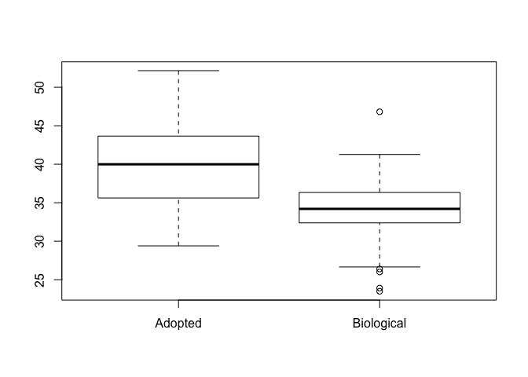

Adoption Metadata Analysis
================
Chiranjit Mukherjee
12/14/2019

``` r
knitr::opts_chunk$set(echo = TRUE)
```

<br>

Setting Seed

``` r
set.seed(12345)
```

#### Loading required libraries and custom functions

``` r
library(dplyr)
library(stargazer)
```

<br>

### Input metadata files

``` r
ISR_sal_meta_mch_mo <- read.table(file="Intermed_files/ISR_sal_meta_mch_mo.txt", header = T, sep="\t")
ISR_sal_meta_mch_ch <- read.table(file="Intermed_files/ISR_sal_meta_mch_ch.txt", header = T, sep="\t")
```

ISR Sal M-Ch Multiple Linear Regression Analysis for unbalanced metadata
------------------------------------------------------------------------

&lt;br.

``` r
# Check dimensions
dim(ISR_sal_meta_mch_mo) # 103 x 24
```

    ## [1] 103  24

``` r
dim(ISR_sal_meta_mch_ch) # 103 x 24 (distances added)
```

    ## [1] 103  25

``` r
# Create new field Caries_yn (yes/no)
ISR_sal_meta_mch_mo$caries_yn <- "No"
ISR_sal_meta_mch_mo$caries_yn[ISR_sal_meta_mch_mo$caries_level > 0] <- "Yes"

# Mother's caries_yn
ISR_sal_meta_mch_ch$mo_caries <- ISR_sal_meta_mch_mo$caries_yn[match(ISR_sal_meta_mch_ch$family_id, ISR_sal_meta_mch_mo$family_id)]

# Mother's gingivitis
ISR_sal_meta_mch_ch$mo_ging <- ISR_sal_meta_mch_mo$gingivitis[match(ISR_sal_meta_mch_ch$family_id, ISR_sal_meta_mch_mo$family_id)]

# Mother's plaque level
ISR_sal_meta_mch_ch$mo_plq_level <- ISR_sal_meta_mch_mo$plaque_level[match(ISR_sal_meta_mch_ch$family_id, ISR_sal_meta_mch_mo$family_id)]

# Mother's ethnicity
ISR_sal_meta_mch_ch$mo_eth <- ISR_sal_meta_mch_mo$ethnicity[match(ISR_sal_meta_mch_ch$family_id, ISR_sal_meta_mch_mo$family_id)]

# Mother's tongue biofilm
ISR_sal_meta_mch_ch$mo_tng_bio <- ISR_sal_meta_mch_mo$tongue_biofilm[match(ISR_sal_meta_mch_ch$family_id, ISR_sal_meta_mch_mo$family_id)]

# Mother's antibiotics
ISR_sal_meta_mch_ch$mo_anti <- ISR_sal_meta_mch_mo$antibiotics_past_month[match(ISR_sal_meta_mch_ch$family_id, ISR_sal_meta_mch_mo$family_id)]

# Mother's race
ISR_sal_meta_mch_ch$mo_race <- ISR_sal_meta_mch_mo$race[match(ISR_sal_meta_mch_ch$family_id, ISR_sal_meta_mch_mo$family_id)]

# ethnicity data not available for most children
ISR_sal_meta_mch_ch$ethnicity <- NULL
```

``` r
# Age

# Stats
set.seed(12345);wilcox.test(ISR_sal_meta_mch_ch$age ~ ISR_sal_meta_mch_ch$status)$p.value # p-value = 0.2937314 (Balanced)
```

    ## [1] 0.2937314

``` r
# Gender
# Check levels
ISR_sal_meta_mch_ch$gender %>% unique()
```

    ## [1] Female Male  
    ## Levels: Female Male

``` r
# Check table
ISR_sal_meta_mch_ch$gender  %>% table()
```

    ## .
    ## Female   Male 
    ##     46     57

``` r
# Contingency Table
gender_table <- table(ISR_sal_meta_mch_ch$gender, ISR_sal_meta_mch_ch$status)

# Check C table
gender_table
```

    ##         
    ##          Adopted Biological
    ##   Female      17         29
    ##   Male        32         25

``` r
#           Adopted Biological
# Female      17         29
# Male        32         25

# Fisher test
set.seed(12345);round(fisher.test(gender_table)$p.value,3) # p-value = 0.074 (Balanced)
```

    ## [1] 0.074

``` r
# Delivery Mode
ISR_sal_meta_mch_ch$del_mode %>% unique()
```

    ## [1] C-Section Vaginally <NA>      Unknown  
    ## Levels: C-Section Unknown Vaginally

``` r
# Fix NA
ISR_sal_meta_mch_ch$del_mode <- gsub("NA", NA, ISR_sal_meta_mch_ch$del_mode)
ISR_sal_meta_mch_ch$del_mode <- gsub("Unknown", NA, ISR_sal_meta_mch_ch$del_mode)

# Check table
ISR_sal_meta_mch_ch$del_mode  %>% table()
```

    ## .
    ## C-Section Vaginally 
    ##        31        68

``` r
# Contingency Table
del_mode_table <- table(ISR_sal_meta_mch_ch$del_mode, ISR_sal_meta_mch_ch$status)

# Check C table
del_mode_table
```

    ##            
    ##             Adopted Biological
    ##   C-Section      12         19
    ##   Vaginally      33         35

``` r
#           Adopted Biological
# C-Section      12         19
# Vaginally      33         35

# Fisher test
set.seed(12345);round(fisher.test(del_mode_table)$p.value, 3) # p-value = 0.392 (Balanced)
```

    ## [1] 0.392

``` r
# Feeding Mode
ISR_sal_meta_mch_ch$feed_mode %>% unique()
```

    ## [1] Breast-fed  Combination Formula-fed <NA>        Unknown    
    ## Levels: Breast-fed Combination Formula-fed Unknown

``` r
# Fix NA
ISR_sal_meta_mch_ch$feed_mode <- gsub("NA", NA, ISR_sal_meta_mch_ch$feed_mode)
ISR_sal_meta_mch_ch$feed_mode <- gsub("Unknown", NA, ISR_sal_meta_mch_ch$feed_mode)

# Check table
ISR_sal_meta_mch_ch$feed_mode  %>% table()
```

    ## .
    ##  Breast-fed Combination Formula-fed 
    ##          21          28          52

``` r
# Contingency Table
feed_mode_table <- table(ISR_sal_meta_mch_ch$feed_mode, ISR_sal_meta_mch_ch$status)

# Check table
feed_mode_table
```

    ##              
    ##               Adopted Biological
    ##   Breast-fed        0         21
    ##   Combination       1         27
    ##   Formula-fed      46          6

``` r
#               Adopted Biological
# Breast-fed        0         21
# Combination       1         27
# Formula-fed      46          6

# Fisher test
set.seed(12345);round(fisher.test(feed_mode_table)$p.value, 3) # 0 (Unbalanced)
```

    ## [1] 0

``` r
# Race
ISR_sal_meta_mch_ch$race %>% unique()
```

    ## [1] White                        White and Asian             
    ## [3] White and Arabic             Black or African American   
    ## [5] Other (both black and white)
    ## 5 Levels: Black or African American ... White and Asian

``` r
# "White"                        "White and Asian"              "White and Arabic"             "Black or African American"    "Other (both black and white)"

# Fix names
ISR_sal_meta_mch_ch$race <- gsub("White and Asian", "Mixed", ISR_sal_meta_mch_ch$race)
ISR_sal_meta_mch_ch$race <- gsub("White and Arabic", "Mixed", ISR_sal_meta_mch_ch$race)
ISR_sal_meta_mch_ch$race <- gsub("Other \\(both black and white\\)", "Mixed", ISR_sal_meta_mch_ch$race)

# Check table
ISR_sal_meta_mch_ch$race  %>% table()
```

    ## .
    ## Black or African American                     Mixed 
    ##                        18                        13 
    ##                     White 
    ##                        72

``` r
# Contingency Table
race_table <- table(ISR_sal_meta_mch_ch$race, ISR_sal_meta_mch_ch$status)

# Check table
race_table
```

    ##                            
    ##                             Adopted Biological
    ##   Black or African American      17          1
    ##   Mixed                           8          5
    ##   White                          24         48

``` r
#                             Adopted   Biological
# Black or African American      17          1
# Mixed                           8          5
# White                          24         48

# Fisher test
set.seed(12345);round(fisher.test(race_table)$p.value, 3) # p-value = 0 (Unbalanced)
```

    ## [1] 0

``` r
# Plaque Level
ISR_sal_meta_mch_ch$plaque_level %>% unique()
```

    ## [1] N/A      Moderate Mild     None     <NA>    
    ## Levels: Mild Moderate N/A None

``` r
# "N/A"      "Moderate" "Mild"     "None"     "NA"

# Fix NA
ISR_sal_meta_mch_ch$plaque_level <- gsub("N/A", NA, ISR_sal_meta_mch_ch$plaque_level)
ISR_sal_meta_mch_ch$plaque_level <- gsub("NA", NA, ISR_sal_meta_mch_ch$plaque_level)


# Check table
ISR_sal_meta_mch_ch$plaque_level  %>% table()
```

    ## .
    ##     Mild Moderate     None 
    ##       44        7       46

``` r
# Contingency Table
plaque_level_table <- table(ISR_sal_meta_mch_ch$plaque_level, ISR_sal_meta_mch_ch$status)

# Check table
plaque_level_table
```

    ##           
    ##            Adopted Biological
    ##   Mild          17         27
    ##   Moderate       3          4
    ##   None          25         21

``` r
#            Adopted Biological
# Mild          17         27
# Moderate       3          4
# None          25         21


# Fisher test
set.seed(12345);round(fisher.test(plaque_level_table)$p.value, 3) # p-value = 0.306 (Balanced)
```

    ## [1] 0.306

``` r
# Tongue Biofilm
ISR_sal_meta_mch_ch$tongue_biofilm %>% unique()
```

    ## [1] <NA>  Light None  Heavy
    ## Levels: Heavy Light None

``` r
# "NA"    "Light" "None"  "Heavy"

# Fix NA
ISR_sal_meta_mch_ch$tongue_biofilm <- gsub("NA", NA, ISR_sal_meta_mch_ch$tongue_biofilm)

# Check table
ISR_sal_meta_mch_ch$tongue_biofilm  %>% table()
```

    ## .
    ## Heavy Light  None 
    ##     1    27    70

``` r
# Contingency Table
tongue_biofilm_table <- table(ISR_sal_meta_mch_ch$tongue_biofilm, ISR_sal_meta_mch_ch$status)

# Check table
tongue_biofilm_table
```

    ##        
    ##         Adopted Biological
    ##   Heavy       1          0
    ##   Light      21          6
    ##   None       24         46

``` r
#            Adopted Biological
# Heavy       1          0
# Light      21          6
# None       24         46


# Fisher test
set.seed(12345);fisher.test(tongue_biofilm_table)$p.value # p-value = 0.0001348483 (Unbalanced)
```

    ## [1] 0.0001348483

``` r
# Gingivitis
ISR_sal_meta_mch_ch$gingivitis %>% unique()
```

    ## [1] <NA>     Moderate None     Mild    
    ## Levels: Mild Moderate None

``` r
# "NA"       "Moderate" "None"     "Mild"

# Fix NA
ISR_sal_meta_mch_ch$gingivitis <- gsub("NA", NA, ISR_sal_meta_mch_ch$gingivitis)


# Check table
ISR_sal_meta_mch_ch$gingivitis %>% table()
```

    ## .
    ##     Mild Moderate     None 
    ##       36        4       58

``` r
# Contingency Table
gingivitis_table <- table(ISR_sal_meta_mch_ch$gingivitis, ISR_sal_meta_mch_ch$status)

# Check table
gingivitis_table
```

    ##           
    ##            Adopted Biological
    ##   Mild          11         25
    ##   Moderate       2          2
    ##   None          33         25

``` r
#            Adopted Biological
# Mild          11         25
# Moderate       2          2
# None          33         25


# Fisher test
set.seed(12345);round(fisher.test(gingivitis_table)$p.value, 3) # p-value = 0.0326 (Unbalanced)
```

    ## [1] 0.033

``` r
# Caries Level
range(ISR_sal_meta_mch_ch$caries_level)
```

    ## [1]  0 11

``` r
# 0 11

# Create new field Caries_yn (yes/no)
ISR_sal_meta_mch_ch$caries_yn <- "No"
ISR_sal_meta_mch_ch$caries_yn[ISR_sal_meta_mch_ch$caries_level > 0] <- "Yes"

# Check table
ISR_sal_meta_mch_ch$caries_yn %>% table()
```

    ## .
    ##  No Yes 
    ##  88  15

``` r
# Contingency Table
caries_yn_table <- table(ISR_sal_meta_mch_ch$caries_yn, ISR_sal_meta_mch_ch$status)

# Check table
caries_yn_table
```

    ##      
    ##       Adopted Biological
    ##   No       42         46
    ##   Yes       7          8

``` r
#        Adopted  Biological
# No       42         46
# Yes       7          8

# Fisher test
set.seed(12345);round(fisher.test(caries_yn_table)$p.value, 3) # p-value = 1 (Balanced)
```

    ## [1] 1

``` r
# Daycare

# School: Yes or No
ISR_sal_meta_mch_ch$School <- as.character(ISR_sal_meta_mch_ch$School)
ISR_sal_meta_mch_ch$School %>% unique()
```

    ## [1] "Daycare"      "None"         NA             "Pre School"  
    ## [5] "kindergarten" "School"

``` r
# "Daycare"      "None"         "NA"           "Pre School"   "kindergarten" "School"   

# Replace NA with MD for missing data
ISR_sal_meta_mch_ch$School[is.na(ISR_sal_meta_mch_ch$School)] <- "MD" # Missing data


# Making new field for Daycare and setting as yes/no field
for (i in 1:nrow(ISR_sal_meta_mch_ch)){
  if (ISR_sal_meta_mch_ch$School[i] == "MD"){
    ISR_sal_meta_mch_ch$daycare[i] = NA
  }
  else if (ISR_sal_meta_mch_ch$School[i] == "None"){
    ISR_sal_meta_mch_ch$daycare[i] = "No"
  }
  else {
    ISR_sal_meta_mch_ch$daycare[i] <- "Yes"
  }
}

# Daycare levels
ISR_sal_meta_mch_ch$daycare  %>% table()
```

    ## .
    ##  No Yes 
    ##  35  65

``` r
# Contingency table
daycare_table <- table(ISR_sal_meta_mch_ch$daycare, ISR_sal_meta_mch_ch$status)

# Check C table
daycare_table
```

    ##      
    ##       Adopted Biological
    ##   No       20         15
    ##   Yes      29         36

``` r
#       Adopted   Biological
# No       20         15
# Yes      29         36

# Fisher test
set.seed(12345);round(fisher.test(daycare_table)$p.value, 3) # p-value = 0.295 (Balanced)
```

    ## [1] 0.295

``` r
# antibiotics_past_month
ISR_sal_meta_mch_ch$antibiotics_past_month %>% unique()
```

    ## [1] No  Yes
    ## Levels: No Yes

``` r
# "No"  "Yes"

# Check table
ISR_sal_meta_mch_ch$antibiotics_past_month %>% table()
```

    ## .
    ##  No Yes 
    ##  96   7

``` r
# Contingency Table
antibiotics_past_month_table <- table(ISR_sal_meta_mch_ch$antibiotics_past_month, ISR_sal_meta_mch_ch$status)

# Check table
antibiotics_past_month_table
```

    ##      
    ##       Adopted Biological
    ##   No       47         49
    ##   Yes       2          5

``` r
#        Adopted Biological
# No       47         49
# Yes       2          5

# Fisher test
set.seed(12345);round(fisher.test(antibiotics_past_month_table)$p.value, 3) # p-value = 0.441 (Balanced)
```

    ## [1] 0.441

``` r
# Mother's age
# Add mother's age for children
ISR_sal_meta_mch_ch$mo_age <- ISR_sal_meta_mch_mo$age[match(ISR_sal_meta_mch_ch$family_id, ISR_sal_meta_mch_mo$family_id)]

boxplot(ISR_sal_meta_mch_ch$mo_age ~ ISR_sal_meta_mch_ch$status)
```



``` r
# Stats
set.seed(12345); wilcox.test(ISR_sal_meta_mch_ch$mo_age ~ ISR_sal_meta_mch_ch$status)$p.value # p-value = 2.122e-06 (Unbalanced)
```

    ## [1] 2.161618e-06

``` r
# Mother's gingivitis
ISR_sal_meta_mch_ch$mo_ging %>% unique()
```

    ## [1] Mild     <NA>     None     Moderate
    ## Levels: Mild Moderate None

``` r
# "NA"       "Moderate" "None"     "Mild"

# Fix NA
ISR_sal_meta_mch_ch$mo_ging <- gsub("NA", NA, ISR_sal_meta_mch_ch$mo_ging)

# Check table
ISR_sal_meta_mch_ch$mo_ging %>% table()
```

    ## .
    ##     Mild Moderate     None 
    ##       39       12       50

``` r
# Contingency Table
mo_ging_table <- table(ISR_sal_meta_mch_ch$mo_ging, ISR_sal_meta_mch_ch$status)

# Check table
mo_ging_table
```

    ##           
    ##            Adopted Biological
    ##   Mild          25         14
    ##   Moderate       7          5
    ##   None          16         34

``` r
#            Adopted Biological
# Mild          25         14
# Moderate       7          5
# None          16         34

# Fisher test
set.seed(12345);round(fisher.test(mo_ging_table)$p.value, 3) # p-value = 0.007327 (Balanced)
```

    ## [1] 0.007

``` r
# mo_plq_level
ISR_sal_meta_mch_ch$mo_plq_level %>% table()
```

    ## .
    ##     Mild Moderate      N/A     none     None 
    ##       57        7        2        1       36

``` r
# Mild Moderate      N/A     none     None 
#  57        7        2        1       37 

# Fix NA
ISR_sal_meta_mch_ch$mo_plq_level <- gsub("N/A", NA, ISR_sal_meta_mch_ch$mo_plq_level)
ISR_sal_meta_mch_ch$mo_plq_level <- gsub("none", "None", ISR_sal_meta_mch_ch$mo_plq_level)

# Contingency Table
mo_plq_level_table <- table(ISR_sal_meta_mch_ch$mo_plq_level, ISR_sal_meta_mch_ch$status)

# Check table
mo_plq_level_table
```

    ##           
    ##            Adopted Biological
    ##   Mild          34         23
    ##   Moderate       5          2
    ##   None           9         28

``` r
#            Adopted   Biological
# Mild          34         23
# Moderate       5          2
# None           9         28

# Fisher test
set.seed(12345);round(fisher.test(mo_plq_level_table)$p.value, 3) # p-value = 0.001 (Unbalanced)
```

    ## [1] 0.001

``` r
# mo_eth
ISR_sal_meta_mch_ch$mo_eth %>% table()
```

    ## .
    ##               Hispanic     Hispanic or Latino Non Hispanic or Latino 
    ##                      1                      1                    101

``` r
# Hispanic     Hispanic or Latino Non Hispanic or Latino 
# 1                      1                    102 

# Fix NA
ISR_sal_meta_mch_ch$mo_eth <- gsub("Hispanic", "Hispanic or Latino", ISR_sal_meta_mch_ch$mo_eth)
ISR_sal_meta_mch_ch$mo_eth <- gsub("or Latino or Latino", "or Latino", ISR_sal_meta_mch_ch$mo_eth)

# Contingency Table
mo_eth_table <- table(ISR_sal_meta_mch_ch$mo_eth, ISR_sal_meta_mch_ch$status)

# Check table
mo_eth_table
```

    ##                         
    ##                          Adopted Biological
    ##   Hispanic or Latino           0          2
    ##   Non Hispanic or Latino      49         52

``` r
#                          Adopted   Biological
# Hispanic or Latino           0          1
# Non Hispanic or Latino      49         52

# Fisher test
set.seed(12345);round(fisher.test(mo_eth_table)$p.value, 3) # p-value = 0.4963 (Balanced)
```

    ## [1] 0.496

``` r
# mo_tng_bio
ISR_sal_meta_mch_ch$mo_tng_bio %>% table()
```

    ## .
    ## Heavy Light  None 
    ##     2    50    49

``` r
#    Heavy Light    NA  None 
#      2    50     2    50

# Fix NA
ISR_sal_meta_mch_ch$mo_tng_bio <- gsub("NA", NA, ISR_sal_meta_mch_ch$mo_tng_bio)

# Contingency Table
mo_tng_bio_table <- table(ISR_sal_meta_mch_ch$mo_tng_bio, ISR_sal_meta_mch_ch$status)

# Check table
mo_tng_bio_table
```

    ##        
    ##         Adopted Biological
    ##   Heavy       1          1
    ##   Light      32         18
    ##   None       15         34

``` r
#         Adopted   Biological
# Heavy       1          1
# Light      32         18
# None       15         34

# Fisher test
set.seed(12345);round(fisher.test(mo_tng_bio_table)$p.value, 3) # p-value = 0.002 (Unbalanced)
```

    ## [1] 0.002

``` r
# mo_anti
ISR_sal_meta_mch_ch$mo_anti %>% table()
```

    ## .
    ##  No Yes 
    ##  92  10

``` r
# NA  No Yes 
#  1  92  10 

# Fix NA
ISR_sal_meta_mch_ch$mo_anti <- gsub("NA", NA, ISR_sal_meta_mch_ch$mo_anti)

# Contingency Table
mo_anti_table <- table(ISR_sal_meta_mch_ch$mo_anti, ISR_sal_meta_mch_ch$status)

# Check table
mo_anti_table
```

    ##      
    ##       Adopted Biological
    ##   No       47         45
    ##   Yes       2          8

``` r
#         Adopted   Biological
# No       47         45
# Yes       2          8

# Fisher test
set.seed(12345);round(fisher.test(mo_anti_table)$p.value, 3) # p-value = 0.09472 (Balanced)
```

    ## [1] 0.095

``` r
# mo_race
ISR_sal_meta_mch_ch$mo_race %>% unique()
```

    ## [1] White                     Asian                    
    ## [3] Black or African American
    ## Levels: Asian Black or African American White

``` r
# "White"                        "Asian"              "Black or African American"

# Check table
ISR_sal_meta_mch_ch$mo_race  %>% table()
```

    ## .
    ##                     Asian Black or African American 
    ##                         3                         2 
    ##                     White 
    ##                        98

``` r
# Contingency Table
mo_race_table <- table(ISR_sal_meta_mch_ch$mo_race, ISR_sal_meta_mch_ch$status)

# Check table
mo_race_table
```

    ##                            
    ##                             Adopted Biological
    ##   Asian                           0          3
    ##   Black or African American       1          1
    ##   White                          48         50

``` r
#                             Adopted   Biological
# Asian                           0          3
# Black or African American       1          1
# White                          48         50

# Fisher test
set.seed(12345);round(fisher.test(mo_race_table)$p.value, 3) # p-value = 0.2444 (Balanced)
```

    ## [1] 0.244

``` r
# Race match

ISR_sal_meta_mch_ch$race_match <- "Yes"
ISR_sal_meta_mch_ch$race_match[ISR_sal_meta_mch_ch$race != ISR_sal_meta_mch_ch$mo_race] <- "No"

# Contingency Table
race_match_table <- table(ISR_sal_meta_mch_ch$race_match, ISR_sal_meta_mch_ch$status)

# Check table
race_match_table
```

    ##      
    ##       Adopted Biological
    ##   No       24          5
    ##   Yes      25         49

``` r
#       Adopted   Biological
# No       24          5
# Yes      25         49

# Fisher test
set.seed(12345);fisher.test(race_match_table)$p.value # p-value = 7.631e-06 (Unblanced)
```

    ## [1] 7.630755e-06

``` r
# The unbalanced variables are: feed_mode, race, tongue_biofilm, gingivitis, mo_age, mo_plq_level, mo_tng_bio, race_match

# Subset
ISR_sal_meta_mch_ch_unb <- ISR_sal_meta_mch_ch[,c("sample", "status", "feed_mode", "race", "tongue_biofilm", "gingivitis", "mo_age","mo_ging", "mo_plq_level", "mo_tng_bio", "race_match", "dist")]
#View(ISR_sal_meta_mch_ch_unb)
dim(ISR_sal_meta_mch_ch_unb) # 103 x 11
```

    ## [1] 103  12

``` r
# Output
#write.table(ISR_sal_meta_mch_ch_unb, file="Intermed_files/ISR_sal_meta_mch_ch_unb.txt", sep = "\t", quote = F, row.names = FALSE)
#write.table(ISR_sal_meta_mch_ch, file="Intermed_files/ISR_sal_meta_mch_ch_updated.txt", sep = "\t", quote = F, row.names = FALSE)
#write.table(ISR_sal_meta_mch_mo, file="Intermed_files/ISR_sal_meta_mch_mo_updated.txt", sep = "\t", quote = F, row.names = FALSE)
```

Metadata Confounder Analysis
----------------------------

#### Refer to ISR Sal Metadata Analysis.Rmd for identificationo of unbalanced metadata

<br> <br>

### Model Building with Unbalanced Clinical/Demographic Variables

<br>

#### Multiple Linear Regression Based Counfounder Analysis

<b>

``` r
# Select only complete cases (exclude NAs) for multiple regression
ISR_sal_meta_mch_ch_unb <- na.omit(ISR_sal_meta_mch_ch_unb)
dim(ISR_sal_meta_mch_ch_unb) # 93  x 11
```

    ## [1] 93 12

``` r
#View(ISR_sal_meta_mch_ch_unb)


# Remove sample column
ISR_sal_meta_mch_ch_unb$sample <- NULL

# Convert to factor and then to numeric for regression analysis
ISR_sal_meta_mch_ch_unb$status <- as.numeric(as.factor(ISR_sal_meta_mch_ch_unb$status)) # Levels: Adopted Biological
ISR_sal_meta_mch_ch_unb$feed_mode <- as.numeric(as.factor(ISR_sal_meta_mch_ch_unb$feed_mode)) # Levels: Breast-fed Combination Formula-fed
ISR_sal_meta_mch_ch_unb$race <- as.numeric(as.factor(ISR_sal_meta_mch_ch_unb$race)) # Levels: Black or African American Mixed White
ISR_sal_meta_mch_ch_unb$gingivitis <- as.numeric(factor(ISR_sal_meta_mch_ch_unb$gingivitis, levels =  c("None", "Mild", "Moderate"))) 
ISR_sal_meta_mch_ch_unb$tongue_biofilm <- as.numeric(factor(ISR_sal_meta_mch_ch_unb$tongue_biofilm, levels =  c("None", "Light", "Heavy")))
ISR_sal_meta_mch_ch_unb$mo_tng_bio <- as.numeric(factor(ISR_sal_meta_mch_ch_unb$mo_tng_bio, levels =  c("None", "Light", "Heavy")))
ISR_sal_meta_mch_ch_unb$mo_plq_level <- as.numeric(factor(ISR_sal_meta_mch_ch_unb$mo_plq_level, levels =  c("None", "Mild", "Moderate")))
ISR_sal_meta_mch_ch_unb$race_match <- as.numeric(as.factor(ISR_sal_meta_mch_ch_unb$race_match)) # Levels: No Yes

# Multiple linear regression analysis
(ISR_sal_meta_mch_ch_unb.fit <- lm(dist ~ status + feed_mode + race + mo_age + gingivitis + tongue_biofilm + mo_tng_bio + mo_plq_level + race_match, data=ISR_sal_meta_mch_ch_unb))
```

    ## 
    ## Call:
    ## lm(formula = dist ~ status + feed_mode + race + mo_age + gingivitis + 
    ##     tongue_biofilm + mo_tng_bio + mo_plq_level + race_match, 
    ##     data = ISR_sal_meta_mch_ch_unb)
    ## 
    ## Coefficients:
    ##    (Intercept)          status       feed_mode            race  
    ##       0.859714       -0.053619        0.002844        0.052472  
    ##         mo_age      gingivitis  tongue_biofilm      mo_tng_bio  
    ##      -0.002367       -0.014335       -0.025511        0.019875  
    ##   mo_plq_level      race_match  
    ##      -0.001808       -0.032171

``` r
(ISR_sal_meta_mch_ch_unb.fit.sum <- summary(ISR_sal_meta_mch_ch_unb.fit)) # none significant
```

    ## 
    ## Call:
    ## lm(formula = dist ~ status + feed_mode + race + mo_age + gingivitis + 
    ##     tongue_biofilm + mo_tng_bio + mo_plq_level + race_match, 
    ##     data = ISR_sal_meta_mch_ch_unb)
    ## 
    ## Residuals:
    ##      Min       1Q   Median       3Q      Max 
    ## -0.32440 -0.07901 -0.00250  0.06574  0.23667 
    ## 
    ## Coefficients:
    ##                 Estimate Std. Error t value Pr(>|t|)    
    ## (Intercept)     0.859714   0.159488   5.390 6.47e-07 ***
    ## status         -0.053619   0.045453  -1.180    0.242    
    ## feed_mode       0.002844   0.023879   0.119    0.905    
    ## race            0.052472   0.034069   1.540    0.127    
    ## mo_age         -0.002367   0.002196  -1.078    0.284    
    ## gingivitis     -0.014335   0.021315  -0.673    0.503    
    ## tongue_biofilm -0.025511   0.027220  -0.937    0.351    
    ## mo_tng_bio      0.019875   0.029042   0.684    0.496    
    ## mo_plq_level   -0.001808   0.027560  -0.066    0.948    
    ## race_match     -0.032171   0.057550  -0.559    0.578    
    ## ---
    ## Signif. codes:  0 '***' 0.001 '**' 0.01 '*' 0.05 '.' 0.1 ' ' 1
    ## 
    ## Residual standard error: 0.1034 on 83 degrees of freedom
    ## Multiple R-squared:  0.1143, Adjusted R-squared:  0.01831 
    ## F-statistic: 1.191 on 9 and 83 DF,  p-value: 0.312

``` r
# Making table for output
ISR_sal_meta_mch_ch_unb.fit_tbl <- data.frame(ISR_sal_meta_mch_ch_unb.fit.sum$coefficients)
colnames(ISR_sal_meta_mch_ch_unb.fit_tbl) <- c("Estimates", "Std. Error", "t-value", "p-value")
#savView(ISR_sal_meta_mch_ch_unb.fit_tbl)
#write.table(ISR_sal_meta_mch_ch_unb.fit_tbl, file="/output/LM_table_sal_ISR_final.txt", sep="\t", row.names = T)
```

New confounding checking
========================

``` r
# Multiple linear regression analysis
fit0<-lm(dist ~ status, data=ISR_sal_meta_mch_ch_unb)
fit1<-lm(dist ~ status+feed_mode, data=ISR_sal_meta_mch_ch_unb)
fit2<-lm(dist ~ status+race, data=ISR_sal_meta_mch_ch_unb)
fit3<-lm(dist ~ status+mo_age, data=ISR_sal_meta_mch_ch_unb)
fit4<-lm(dist ~ status+gingivitis, data=ISR_sal_meta_mch_ch_unb)
fit5<-lm(dist ~ status+tongue_biofilm, data=ISR_sal_meta_mch_ch_unb)
fit6<-lm(dist ~ status+mo_ging, data=ISR_sal_meta_mch_ch_unb)
fit7<-lm(dist ~ status+mo_tng_bio, data=ISR_sal_meta_mch_ch_unb)
fit8<-lm(dist ~ status+mo_plq_level, data=ISR_sal_meta_mch_ch_unb)
fit9<-lm(dist ~ status+race_match, data=ISR_sal_meta_mch_ch_unb)
fit10<-lm(dist ~ status + feed_mode + race + mo_age + gingivitis + tongue_biofilm +mo_ging+mo_tng_bio + mo_plq_level + race_match, data=ISR_sal_meta_mch_ch_unb)

stargazer(header=F,fit0,fit1,fit2,fit3,fit4,fit5,fit6,fit7,fit8,fit9,fit10,type="html",report="vcp*",title="Check confounding")
```

<table style="text-align:center">
<caption>
<strong>Check confounding</strong>
</caption>
<tr>
<td colspan="12" style="border-bottom: 1px solid black">
</td>
</tr>
<tr>
<td style="text-align:left">
</td>
<td colspan="11">
<em>Dependent variable:</em>
</td>
</tr>
<tr>
<td>
</td>
<td colspan="11" style="border-bottom: 1px solid black">
</td>
</tr>
<tr>
<td style="text-align:left">
</td>
<td colspan="11">
dist
</td>
</tr>
<tr>
<td style="text-align:left">
</td>
<td>
(1)
</td>
<td>
(2)
</td>
<td>
(3)
</td>
<td>
(4)
</td>
<td>
(5)
</td>
<td>
(6)
</td>
<td>
(7)
</td>
<td>
(8)
</td>
<td>
(9)
</td>
<td>
(10)
</td>
<td>
(11)
</td>
</tr>
<tr>
<td colspan="12" style="border-bottom: 1px solid black">
</td>
</tr>
<tr>
<td style="text-align:left">
status
</td>
<td>
-0.017
</td>
<td>
0.003
</td>
<td>
-0.047
</td>
<td>
-0.033
</td>
<td>
-0.012
</td>
<td>
-0.027
</td>
<td>
-0.021
</td>
<td>
-0.014
</td>
<td>
-0.020
</td>
<td>
-0.039
</td>
<td>
-0.063
</td>
</tr>
<tr>
<td style="text-align:left">
</td>
<td>
p = 0.433
</td>
<td>
p = 0.926
</td>
<td>
p = 0.054<sup>\*</sup>
</td>
<td>
p = 0.192
</td>
<td>
p = 0.596
</td>
<td>
p = 0.265
</td>
<td>
p = 0.373
</td>
<td>
p = 0.544
</td>
<td>
p = 0.385
</td>
<td>
p = 0.116
</td>
<td>
p = 0.177
</td>
</tr>
<tr>
<td style="text-align:left">
</td>
<td>
</td>
<td>
</td>
<td>
</td>
<td>
</td>
<td>
</td>
<td>
</td>
<td>
</td>
<td>
</td>
<td>
</td>
<td>
</td>
<td>
</td>
</tr>
<tr>
<td style="text-align:left">
feed\_mode
</td>
<td>
</td>
<td>
0.016
</td>
<td>
</td>
<td>
</td>
<td>
</td>
<td>
</td>
<td>
</td>
<td>
</td>
<td>
</td>
<td>
</td>
<td>
-0.001
</td>
</tr>
<tr>
<td style="text-align:left">
</td>
<td>
</td>
<td>
p = 0.455
</td>
<td>
</td>
<td>
</td>
<td>
</td>
<td>
</td>
<td>
</td>
<td>
</td>
<td>
</td>
<td>
</td>
<td>
p = 0.969
</td>
</tr>
<tr>
<td style="text-align:left">
</td>
<td>
</td>
<td>
</td>
<td>
</td>
<td>
</td>
<td>
</td>
<td>
</td>
<td>
</td>
<td>
</td>
<td>
</td>
<td>
</td>
<td>
</td>
</tr>
<tr>
<td style="text-align:left">
race
</td>
<td>
</td>
<td>
</td>
<td>
0.040
</td>
<td>
</td>
<td>
</td>
<td>
</td>
<td>
</td>
<td>
</td>
<td>
</td>
<td>
</td>
<td>
0.050
</td>
</tr>
<tr>
<td style="text-align:left">
</td>
<td>
</td>
<td>
</td>
<td>
p = 0.012<sup>\*\*</sup>
</td>
<td>
</td>
<td>
</td>
<td>
</td>
<td>
</td>
<td>
</td>
<td>
</td>
<td>
</td>
<td>
p = 0.151
</td>
</tr>
<tr>
<td style="text-align:left">
</td>
<td>
</td>
<td>
</td>
<td>
</td>
<td>
</td>
<td>
</td>
<td>
</td>
<td>
</td>
<td>
</td>
<td>
</td>
<td>
</td>
<td>
</td>
</tr>
<tr>
<td style="text-align:left">
mo\_age
</td>
<td>
</td>
<td>
</td>
<td>
</td>
<td>
-0.003
</td>
<td>
</td>
<td>
</td>
<td>
</td>
<td>
</td>
<td>
</td>
<td>
</td>
<td>
-0.003
</td>
</tr>
<tr>
<td style="text-align:left">
</td>
<td>
</td>
<td>
</td>
<td>
</td>
<td>
p = 0.203
</td>
<td>
</td>
<td>
</td>
<td>
</td>
<td>
</td>
<td>
</td>
<td>
</td>
<td>
p = 0.240
</td>
</tr>
<tr>
<td style="text-align:left">
</td>
<td>
</td>
<td>
</td>
<td>
</td>
<td>
</td>
<td>
</td>
<td>
</td>
<td>
</td>
<td>
</td>
<td>
</td>
<td>
</td>
<td>
</td>
</tr>
<tr>
<td style="text-align:left">
gingivitis
</td>
<td>
</td>
<td>
</td>
<td>
</td>
<td>
</td>
<td>
-0.023
</td>
<td>
</td>
<td>
</td>
<td>
</td>
<td>
</td>
<td>
</td>
<td>
-0.017
</td>
</tr>
<tr>
<td style="text-align:left">
</td>
<td>
</td>
<td>
</td>
<td>
</td>
<td>
</td>
<td>
p = 0.236
</td>
<td>
</td>
<td>
</td>
<td>
</td>
<td>
</td>
<td>
</td>
<td>
p = 0.434
</td>
</tr>
<tr>
<td style="text-align:left">
</td>
<td>
</td>
<td>
</td>
<td>
</td>
<td>
</td>
<td>
</td>
<td>
</td>
<td>
</td>
<td>
</td>
<td>
</td>
<td>
</td>
<td>
</td>
</tr>
<tr>
<td style="text-align:left">
tongue\_biofilm
</td>
<td>
</td>
<td>
</td>
<td>
</td>
<td>
</td>
<td>
</td>
<td>
-0.024
</td>
<td>
</td>
<td>
</td>
<td>
</td>
<td>
</td>
<td>
-0.029
</td>
</tr>
<tr>
<td style="text-align:left">
</td>
<td>
</td>
<td>
</td>
<td>
</td>
<td>
</td>
<td>
</td>
<td>
p = 0.336
</td>
<td>
</td>
<td>
</td>
<td>
</td>
<td>
</td>
<td>
p = 0.302
</td>
</tr>
<tr>
<td style="text-align:left">
</td>
<td>
</td>
<td>
</td>
<td>
</td>
<td>
</td>
<td>
</td>
<td>
</td>
<td>
</td>
<td>
</td>
<td>
</td>
<td>
</td>
<td>
</td>
</tr>
<tr>
<td style="text-align:left">
mo\_gingModerate
</td>
<td>
</td>
<td>
</td>
<td>
</td>
<td>
</td>
<td>
</td>
<td>
</td>
<td>
0.030
</td>
<td>
</td>
<td>
</td>
<td>
</td>
<td>
0.048
</td>
</tr>
<tr>
<td style="text-align:left">
</td>
<td>
</td>
<td>
</td>
<td>
</td>
<td>
</td>
<td>
</td>
<td>
</td>
<td>
p = 0.395
</td>
<td>
</td>
<td>
</td>
<td>
</td>
<td>
p = 0.203
</td>
</tr>
<tr>
<td style="text-align:left">
</td>
<td>
</td>
<td>
</td>
<td>
</td>
<td>
</td>
<td>
</td>
<td>
</td>
<td>
</td>
<td>
</td>
<td>
</td>
<td>
</td>
<td>
</td>
</tr>
<tr>
<td style="text-align:left">
mo\_gingNone
</td>
<td>
</td>
<td>
</td>
<td>
</td>
<td>
</td>
<td>
</td>
<td>
</td>
<td>
0.019
</td>
<td>
</td>
<td>
</td>
<td>
</td>
<td>
0.013
</td>
</tr>
<tr>
<td style="text-align:left">
</td>
<td>
</td>
<td>
</td>
<td>
</td>
<td>
</td>
<td>
</td>
<td>
</td>
<td>
p = 0.451
</td>
<td>
</td>
<td>
</td>
<td>
</td>
<td>
p = 0.690
</td>
</tr>
<tr>
<td style="text-align:left">
</td>
<td>
</td>
<td>
</td>
<td>
</td>
<td>
</td>
<td>
</td>
<td>
</td>
<td>
</td>
<td>
</td>
<td>
</td>
<td>
</td>
<td>
</td>
</tr>
<tr>
<td style="text-align:left">
mo\_tng\_bio
</td>
<td>
</td>
<td>
</td>
<td>
</td>
<td>
</td>
<td>
</td>
<td>
</td>
<td>
</td>
<td>
0.009
</td>
<td>
</td>
<td>
</td>
<td>
0.022
</td>
</tr>
<tr>
<td style="text-align:left">
</td>
<td>
</td>
<td>
</td>
<td>
</td>
<td>
</td>
<td>
</td>
<td>
</td>
<td>
</td>
<td>
p = 0.662
</td>
<td>
</td>
<td>
</td>
<td>
p = 0.471
</td>
</tr>
<tr>
<td style="text-align:left">
</td>
<td>
</td>
<td>
</td>
<td>
</td>
<td>
</td>
<td>
</td>
<td>
</td>
<td>
</td>
<td>
</td>
<td>
</td>
<td>
</td>
<td>
</td>
</tr>
<tr>
<td style="text-align:left">
mo\_plq\_level
</td>
<td>
</td>
<td>
</td>
<td>
</td>
<td>
</td>
<td>
</td>
<td>
</td>
<td>
</td>
<td>
</td>
<td>
-0.008
</td>
<td>
</td>
<td>
-0.005
</td>
</tr>
<tr>
<td style="text-align:left">
</td>
<td>
</td>
<td>
</td>
<td>
</td>
<td>
</td>
<td>
</td>
<td>
</td>
<td>
</td>
<td>
</td>
<td>
p = 0.687
</td>
<td>
</td>
<td>
p = 0.881
</td>
</tr>
<tr>
<td style="text-align:left">
</td>
<td>
</td>
<td>
</td>
<td>
</td>
<td>
</td>
<td>
</td>
<td>
</td>
<td>
</td>
<td>
</td>
<td>
</td>
<td>
</td>
<td>
</td>
</tr>
<tr>
<td style="text-align:left">
race\_match
</td>
<td>
</td>
<td>
</td>
<td>
</td>
<td>
</td>
<td>
</td>
<td>
</td>
<td>
</td>
<td>
</td>
<td>
</td>
<td>
0.050
</td>
<td>
-0.025
</td>
</tr>
<tr>
<td style="text-align:left">
</td>
<td>
</td>
<td>
</td>
<td>
</td>
<td>
</td>
<td>
</td>
<td>
</td>
<td>
</td>
<td>
</td>
<td>
</td>
<td>
p = 0.062<sup>\*</sup>
</td>
<td>
p = 0.669
</td>
</tr>
<tr>
<td style="text-align:left">
</td>
<td>
</td>
<td>
</td>
<td>
</td>
<td>
</td>
<td>
</td>
<td>
</td>
<td>
</td>
<td>
</td>
<td>
</td>
<td>
</td>
<td>
</td>
</tr>
<tr>
<td style="text-align:left">
Constant
</td>
<td>
0.773
</td>
<td>
0.704
</td>
<td>
0.718
</td>
<td>
0.896
</td>
<td>
0.798
</td>
<td>
0.820
</td>
<td>
0.765
</td>
<td>
0.754
</td>
<td>
0.791
</td>
<td>
0.720
</td>
<td>
0.884
</td>
</tr>
<tr>
<td style="text-align:left">
</td>
<td>
p = 0.000<sup>\*\*\*</sup>
</td>
<td>
p = 0.000<sup>\*\*\*</sup>
</td>
<td>
p = 0.000<sup>\*\*\*</sup>
</td>
<td>
p = 0.000<sup>\*\*\*</sup>
</td>
<td>
p = 0.000<sup>\*\*\*</sup>
</td>
<td>
p = 0.000<sup>\*\*\*</sup>
</td>
<td>
p = 0.000<sup>\*\*\*</sup>
</td>
<td>
p = 0.000<sup>\*\*\*</sup>
</td>
<td>
p = 0.000<sup>\*\*\*</sup>
</td>
<td>
p = 0.000<sup>\*\*\*</sup>
</td>
<td>
p = 0.00001<sup>\*\*\*</sup>
</td>
</tr>
<tr>
<td style="text-align:left">
</td>
<td>
</td>
<td>
</td>
<td>
</td>
<td>
</td>
<td>
</td>
<td>
</td>
<td>
</td>
<td>
</td>
<td>
</td>
<td>
</td>
<td>
</td>
</tr>
<tr>
<td colspan="12" style="border-bottom: 1px solid black">
</td>
</tr>
<tr>
<td style="text-align:left">
Observations
</td>
<td>
93
</td>
<td>
93
</td>
<td>
93
</td>
<td>
93
</td>
<td>
93
</td>
<td>
93
</td>
<td>
93
</td>
<td>
93
</td>
<td>
93
</td>
<td>
93
</td>
<td>
93
</td>
</tr>
<tr>
<td style="text-align:left">
R<sup>2</sup>
</td>
<td>
0.007
</td>
<td>
0.013
</td>
<td>
0.076
</td>
<td>
0.025
</td>
<td>
0.022
</td>
<td>
0.017
</td>
<td>
0.017
</td>
<td>
0.009
</td>
<td>
0.009
</td>
<td>
0.045
</td>
<td>
0.133
</td>
</tr>
<tr>
<td style="text-align:left">
Adjusted R<sup>2</sup>
</td>
<td>
-0.004
</td>
<td>
-0.009
</td>
<td>
0.055
</td>
<td>
0.003
</td>
<td>
0.001
</td>
<td>
-0.005
</td>
<td>
-0.016
</td>
<td>
-0.013
</td>
<td>
-0.013
</td>
<td>
0.024
</td>
<td>
0.015
</td>
</tr>
<tr>
<td style="text-align:left">
Residual Std. Error
</td>
<td>
0.105 (df = 91)
</td>
<td>
0.105 (df = 90)
</td>
<td>
0.101 (df = 90)
</td>
<td>
0.104 (df = 90)
</td>
<td>
0.104 (df = 90)
</td>
<td>
0.105 (df = 90)
</td>
<td>
0.105 (df = 89)
</td>
<td>
0.105 (df = 90)
</td>
<td>
0.105 (df = 90)
</td>
<td>
0.103 (df = 90)
</td>
<td>
0.104 (df = 81)
</td>
</tr>
<tr>
<td style="text-align:left">
F Statistic
</td>
<td>
0.622 (df = 1; 91)
</td>
<td>
0.592 (df = 2; 90)
</td>
<td>
3.676<sup>\*\*</sup> (df = 2; 90)
</td>
<td>
1.136 (df = 2; 90)
</td>
<td>
1.026 (df = 2; 90)
</td>
<td>
0.780 (df = 2; 90)
</td>
<td>
0.520 (df = 3; 89)
</td>
<td>
0.405 (df = 2; 90)
</td>
<td>
0.390 (df = 2; 90)
</td>
<td>
2.109 (df = 2; 90)
</td>
<td>
1.129 (df = 11; 81)
</td>
</tr>
<tr>
<td colspan="12" style="border-bottom: 1px solid black">
</td>
</tr>
<tr>
<td style="text-align:left">
<em>Note:</em>
</td>
<td colspan="11" style="text-align:right">
<sup>*</sup>p&lt;0.1; <sup>**</sup>p&lt;0.05; <sup>***</sup>p&lt;0.01
</td>
</tr>
</table>
